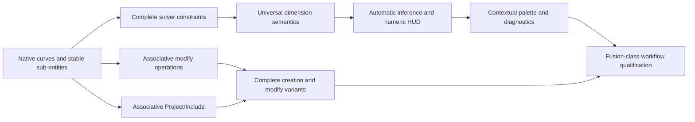

# Fusion-Class 2D Sketch Capability Roadmap

- Status: active roadmap; initial native-geometry vertical slices, including distinct ellipses and elliptical arcs, delivered 2026-08-09
- Scope: Crawler's planar, parametric sketch workspace
- References: Autodesk Fusion Sketch documentation, Plasticity product workflow, and Crawler's current sketch contracts
- Performance evidence: [`../qualification/sketch-performance-baseline.md`](../qualification/sketch-performance-baseline.md)
- Performance quick-win plan: [`sketch-performance-quick-wins.md`](sketch-performance-quick-wins.md)

## 1. Product objective

Crawler should combine Fusion-class retained parametric intent with the low-friction
selection, preview, snapping, and direct manipulation associated with Plasticity.
Fusion is the reference for durable sketch semantics; Plasticity is an interaction
reference, not an architectural reference, because Crawler retains history,
constraints, parameters, and downstream dependencies.

Feature parity means more than exposing similarly named buttons. A capability is
complete only when its geometry remains native, every defining value can be edited,
constraints attach to stable sub-entities, downstream profiles update without
identity churn, and the workflow survives undo, save, reload, and recompute.

## 2. Current baseline and primary gap

Crawler already has a strong workspace shell:

- dedicated sketch entry, support selection, edit, finish, and discard flows;
- persistent tool invocation and separate one-use completion;
- selection-first and tool-first operand collection;
- explicit cursor, selection, tool, and solver states;
- core line, circle, arc, and rectangle geometry;
- core geometric and dimensional constraints;
- Smart Dimension, reference dimensions, parameters, and expressions;
- implied origin references and plane-correct 3D sketch display;
- sketch-local undo/redo and durable document commits.

The P0 native-geometry program is now in place. The solver model contains lines,
circles, arcs, rectangles, degree/knotted control-point B-splines, open
four-point fit splines, principal-axis ellipses and elliptical arcs, rational
quadratic conics, and native sketch points. Offsets retain source interval and
distance intent, while mirror and patterns remain the associative P1 work.
Adaptive tolerance-bounded curve services, generalized tangency, G2 endpoint
continuity, and the complete P0 dimension/constraint surface are implemented.

## 3. Ordered capability program

### 3.1 Native geometry and stable sub-entities — P0

Add native sketch points, ellipses, elliptical arcs, fit-point splines,
control-point B-splines, and conics. Composite generators such as rectangles,
polygons, and slots should retain their defining recipe where later editing
depends on it.

Every curve kind must provide:

- stable endpoint, center, control-point, fit-point, knot, and curve-parameter references;
- position, tangent, and curvature evaluation;
- closest-point projection and hit testing;
- exact or tolerance-bounded curve intersections;
- splitting, trimming, bounding, and offset support;
- deterministic plane-local tessellation for display without replacing the native curve.

### 3.2 Complete geometric constraints — P0

Add collinear, symmetry, curvature continuity, point-pair horizontal/vertical,
object-level fix/unfix, complete point-to-curve coincidence, and robust tangency
across every compatible native curve pair. Internal relationships generated by
slots, polygons, offsets, mirrors, and patterns must remain explicit and editable.

Constraint application must predict conflicts, preserve unrelated intent, and
identify a minimal actionable conflict set.

### 3.3 Universal Smart Dimension — P0

One dimension command should dispatch among line length; horizontal, vertical,
and aligned point distances; point-to-line distance; parallel-line separation;
line-to-line angle; radius or diameter; center or tangent measurement; ellipse
major/minor radii; and retained offset distance.

Driving and driven dimensions, named parameters, expressions, annotation
placement, and direct canvas editing must share one durable dimension identity.

### 3.4 Automatic constraints and inferencing — P0

Creation should infer and preview origin, coincident, horizontal, vertical,
parallel, perpendicular, tangent, midpoint, center, collinear, equal, and
point-on-object intent. Each inference needs a distinct badge, source/target
prehighlight, deterministic priority, a temporary suppression modifier, and a
visible indication of the constraint that will be committed.

### 3.5 Associative modification tools — P1

Replace baked copies with retained operations:

- chain/profile offset with one-side, two-side, distance, topology matching, and unlink;
- mirror about a selected line or axis with durable symmetry;
- rectangular and circular patterns with editable count, spacing, extent,
  direction, angle, handles, and per-instance suppression;
- fillet and all chamfer modes with editable dimensions and generated constraints;
- break, scale, move/copy, and tangent or G2 blend curves.

### 3.6 Associative Project/Include — P1

Project points, edges, faces, bodies, work geometry, and other sketches. Support
automatic support-face boundaries, link/unlink, locked projected geometry,
source-driven recompute, missing-reference repair, and intersection with the
active sketch plane.

### 3.7 Contextual palette and diagnostic display — P1

Add tool/object contextual options, Look At, Slice, grid and snap controls, and
visibility controls for profiles, points, dimensions, constraints, construction,
and projection. Surface remaining degrees of freedom, fully constrained state,
constraint participation, conflicts, gaps, overlaps, and orphaned references in
the canvas rather than only in status text.

Delivered P1 slice: retained canonical operation records and recomputation,
editable contextual operation panels, projected topology references with repair
state, palette controls, and canvas-level solve/profile/reference diagnostics.
The reproducible evidence is recorded in
[`../qualification/sketch-p1-qualification.md`](../qualification/sketch-p1-qualification.md).

### 3.8 Remaining creation surface — P2

Complete the creation variants for rectangles, circles, arcs, polygons, and
slots; then add sketch text, text on path, explode-to-curves, and native-curve
SVG/DXF interchange.

Delivered P2 slice: method-specific retained creation across every listed
family, editable straight/path text with explode-to-native-curves, and SVG/DXF
native-curve import/export. The reproducible acceptance mapping and gate are
recorded in
[`../qualification/sketch-p2-qualification.md`](../qualification/sketch-p2-qualification.md).

## 4. Delivery sequence

The first vertical slices are control-point spline, fit-point spline, ellipse,
elliptical arc, conic, and native sketch point, in that order. Each slice includes creation,
editing, constraints applicable to its sub-entities, rendering, profiles,
persistence, undo, reload, and 3D display.

Delivered initial vertical slices:

- one native open cubic spline entity with four stable `control:N` references;
- solver-addressable control points and endpoint profile connectivity;
- repeatable creation, evaluated preview, direct handles, exact coordinate editing,
  construction mode, constraints, undo/redo, and selection diagnostics;
- canonical document persistence, runtime reload, browser hydration, deterministic
  DXF display tessellation, and committed support-plane 3D display;
- explicit disabled reasons for deferred spline trim, offset, and point-on-curve behavior.
- one native four-fit-point spline with stable `fit:N` references and endpoint
  profile connectivity;
- one native affine ellipse with stable `center`, `major`, and `minor` handles,
  closed-profile recognition, and no polygon expansion;
- one distinct native affine elliptical arc with stable `center`, `major`,
  `minor`, `start`, and `end` handles, projected endpoints, directed sweep, and
  open-profile connectivity;
- one native rational quadratic conic with stable `start`, `control`, and `end`
  handles plus an identity-preserving editable weight;
- one native sketch point with a stable `position` reference, solver variables,
  constraints, and a visible committed 3D cross;
- shared repeatable creation, contextual exact-coordinate panels, deterministic
  evaluation/hit testing, canonical runtime persistence/reload, construction
  behavior, support-plane 3D display, disabled unsupported modifiers, and an
  end-to-end browser qualification across the remaining tools.

## 5. Shared completion standard

A sketch capability is complete when:

1. Its authoritative document representation is native and canonical.
2. Display tessellation never replaces or mutates its native definition.
3. Defining values and stable sub-entities remain editable after reload.
4. Toolbar, panel, HUD, canvas, keyboard, and solver project one command state.
5. Tool-first and selection-first flows both work.
6. Invalid selections are disabled or explained before invocation.
7. Apply is atomic; failure retains the accepted draft and preview.
8. Undo/redo restore geometry, constraints, dimensions, solver state, and selection-safe identities.
9. Downstream profiles and features recompute without unrelated identity churn.
10. Unit, solver, persistence, and browser lifecycle tests cover creation and later editing.

## 6. Qualification workload

Maintain a growing set of representative sketches rather than isolated command
tests: constrained mechanical profiles, spline/line mixed loops, projected
references, mirrored and patterned cutouts, editable offsets, and parameter-driven
variants. Each workload must be reproducible through the public UI and compare
canonical state before and after save/reload.
