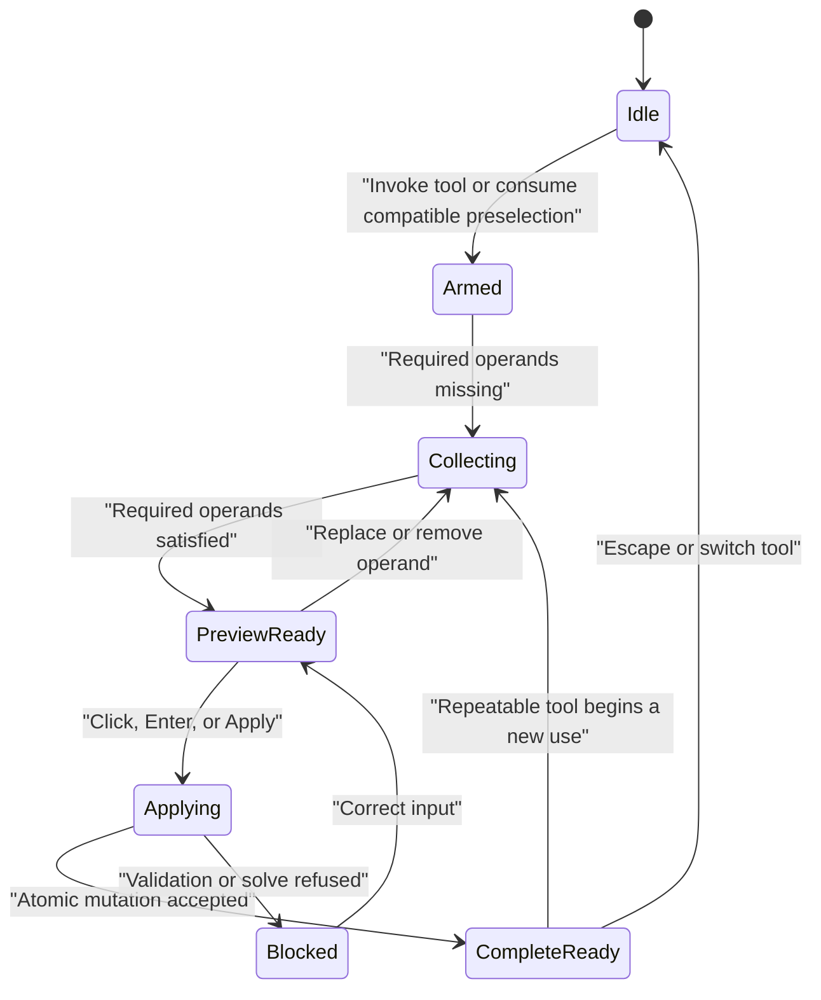
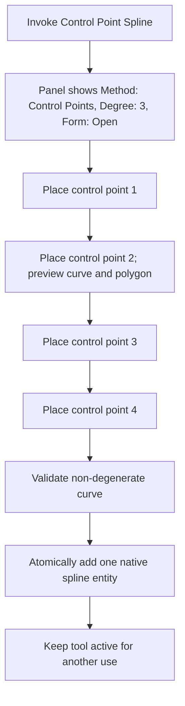

# Native Curve and Contextual Sketch Panel Architecture

- Status: normative design; initial five bounded slices implemented 2026-08-09
- First implementation slice: cubic open control-point spline
- Parent roadmap: `fusion-class-2d-sketch-roadmap.md`

## 1. Principle

Native curve work is a vertical product slice. Solver geometry, document storage,
canvas rendering, direct manipulation, contextual panels, persistence, and tests
must land together. Adding a geometry enum without its editing flow, or adding a
toolbar button that emits a polyline, does not satisfy the slice.

## 2. Coordinated interaction surfaces

### 2.1 Persistent Sketch Palette

The persistent palette owns workspace-wide controls: active tool and phase,
construction or centerline mode, grid and snap, profile/point/dimension/constraint/
construction/projection visibility, Look At, Slice, solver state, and Finish Sketch.

### 2.2 Contextual Command Panel

An active command projects its variant, ordered operand collectors, exact
parameters, preview state, validation, completion policy, and repeat policy into
the inspector. Operand rows are focusable collectors with replace, clear, and
selection feedback; an enabled action must never silently no-op.

### 2.3 In-canvas numeric HUD

Primary values remain beside the pointer. Typing locks a value, `Tab` advances
between fields, and pointer motion continues controlling unlocked values. The HUD
and panel edit the same parameter state.

### 2.4 Selection Inspector

With no command collecting input, selecting a native curve displays its defining
representation and editable values. Canvas handles and inspector fields apply the
same immutable sketch commands and therefore share undo and solver behavior.

### 2.5 Canvas handles and glyphs

The canvas owns spatial manipulation: control points, control polygon, tangent
handles, curvature combs, axis handles, constraint badges, dimensions, snaps, and
previews. The panel explains and enters exact values; it does not replace direct
manipulation.

## 3. Single command-state projection



Toolbar state, inspector content, HUD fields, cursor badges, selection filters,
preview geometry, shortcuts, and documentation must be generated from one tool
definition rather than implementing separate behavior.

```ts
type SketchToolDefinition = {
  variants: ToolVariant[];
  operandSlots: OperandSlot[];
  parameters: ParameterField[];
  preview: PreviewContract;
  completion: CompletionPolicy;
  repeat: RepeatPolicy;
  editExisting: EditContract;
  selectionCompatibility: SelectionRule[];
};
```

## 4. Stable native-curve contract

Every native curve has a stable geometry ID and stable sub-entity references.
Control and fit points must be addressed by index within the curve's canonical
definition; display samples are never addressable geometry. Curve evaluation and
tessellation are deterministic functions of the native definition.

The curve API eventually owns position, tangent, curvature, closest point,
intersection, split, trim, offset, bounds, and adaptive display sampling. The
first slice may implement only the operations required by its accepted workflows,
but its serialized shape and sub-entity addressing must be forward compatible.

## 5. First vertical slice: cubic control-point spline

### 5.1 Bounded initial capability

The first slice is one open, clamped, degree-three spline defined by four stable
control points. This is a native cubic curve, not a sampled polyline. General
degree, additional control points, rational weights, closed/periodic form, fit
points, knots, tangent constraints, and curvature constraints follow without
changing its identity model.

### 5.2 Creation flow



Escape removes the last uncommitted point, then exits the tool. Enter completes
only when the required definition exists. Construction mode applies to the native
entity. Automatic coincident/origin constraints may attach to stable spline
control-point references when the corresponding placed point snapped.

### 5.3 Edit flow

Selecting the spline displays:

- Method: Control Points;
- Degree: 3;
- Form: Open;
- control-point count;
- construction state;
- show/hide control polygon;
- exact X/Y values for each control point;
- attached constraints and solver status.

Dragging a control handle or editing its coordinate applies the same `MovePoint`
command addressed to `control:N`. The spline remains one entity and retains its
constraints and downstream references.

### 5.4 Rendering and profiles

The edit overlay displays the evaluated curve plus, while active or selected,
its control polygon and four handles. Committed 3D sketch display tessellates the
same native definition onto the resolved sketch plane. Profile analysis uses the
native curve endpoints for topology and deterministic samples only for display or
intersection diagnostics.

### 5.5 Acceptance scenarios

- Creating a spline commits exactly one native spline entity.
- The document stores degree and four control points without polyline expansion.
- The solver reports eight scalar variables before constraints.
- Dragging any control point changes the native definition and curve preview.
- Endpoint/control-point coincident, origin, fixed, and distance constraints use stable references.
- Construction mode and removal work without special cases.
- Undo/redo and save/reload preserve identity, degree, points, and constraints.
- Finished sketches display the curve on XY, XZ, YZ, topology, and construction planes.
- A spline can participate in a mixed line/spline closed profile through exact endpoint connectivity.
- The active and selected-spline panels expose their contextual state without duplicating command logic.
- TypeScript build, Rust tests, unit tests, and Playwright creation/edit/reload flows pass.

## 6. Deferred from the first slice

The following are explicit later slices rather than hidden approximations:

- arbitrary degree and control-point count;
- closed and periodic splines;
- rational control-point weights and knot editing;
- fit-point conversion;
- point-on-spline, tangent, and G2 constraints;
- exact spline intersections, trim, offset, DXF SPLINE interchange, and curvature combs.

The UI may show unavailable future variants only when they have a clear disabled
reason; it must not invoke them or substitute polylines.

## 7. First-slice implementation record

The shipped slice follows the bounded contract above:

- `control_point_spline` is canonical geometry in the sketch solver and durable document;
- anchors serialize as `control:0` through `control:3`, while `start` and `end`
  remain endpoint aliases for profile and future curve-wide workflows;
- EZPZ owns two scalar variables per control point; existing point constraints
  and constrained drag operate without a spline-specific UI mutation path;
- one deterministic evaluator feeds edit-overlay rendering, hit testing,
  diagnostics, previews, and committed plane-local 3D tessellation;
- the contextual panel projects method, degree, form, point count, polygon
  visibility, and exact X/Y control-point fields;
- creation automatically returns to collection after an accepted use while the
  tool invocation remains active;
- unsupported trim, offset, and point-on-spline selections are disabled with a
  reason rather than accepted as no-ops;
- Rust solver/runtime tests, browser unit tests, the production build, and a
  Playwright create/edit/constrain/finish scenario qualify the slice.

## 8. Remaining bounded vertical-slice contracts

The next slices preserve the same native-entity, stable-anchor, repeatable-tool,
contextual-panel, and plane-rendering contract. Their bounded first forms are:

1. `fit_point_spline`: an open four-fit-point Catmull-Rom spline with `fit:0`
   through `fit:3` anchors and endpoint aliases. Interpolation points, not
   tessellation samples, are solver variables.
2. `ellipse`: a closed affine ellipse defined by stable `center`, `major`, and
   `minor` point anchors; the ellipse tool never emits a polygonal substitute.
3. `elliptical_arc`: an open affine ellipse sweep defined by stable `center`,
   `major`, `minor`, `start`, and `end` anchors plus clockwise direction. Start
   and end input is projected onto the native ellipse rather than sampled.
4. `conic`: a rational quadratic Bezier defined by `start`, `control`, `end`,
   and a positive integer `weight_millionths` parameter. The weight is editable
   without replacing the entity.
5. `sketch_point`: a native two-variable entity with one stable `position`
   anchor, distinct from legacy document points used to define old line data.

Each slice includes creation and repeat, direct point manipulation, inspector
fields, immutable commands and undo, solver participation, durable round-trip,
deterministic hit-testing and display sampling, profile behavior, construction
semantics where meaningful, committed 3D plane display, and explicit disabled
reasons for operations not yet supported.

## 9. Remaining-slice implementation record

The bounded contracts in section 8 are implemented end to end:

- all five are canonical solver geometry and durable `SketchElement` variants;
- fit points, ellipse axes, conic defining points, and sketch-point position are
  stable solver-addressable anchors used by the ordinary move, coincident,
  origin, fixed, distance, midpoint-operand, undo, and persistence paths;
- the conic weight uses a dedicated immutable command and survives reload without
  replacing the conic entity;
- creation tools consume four, three, five, three, and one point respectively, commit
  one native entity, and return to collection without ending the invocation;
- active or selected entities expose native representation, stable identity,
  exact defining coordinates, and conic weight in the contextual panel;
- deterministic evaluators feed previews, SVG selection paths, hit testing,
  diagnostics, profile tessellation, DXF boundary export, and committed 3D plane
  display; ellipse is a native closed profile and sketch point is excluded from
  profile topology;
- unsupported trim, offset, and point-on-curve combinations are disabled with a
  reason instead of becoming enabled no-ops;
- Rust canonical/solver/runtime tests, browser hydration/evaluation/display/unit
  tests, production compilation, and a Playwright create/edit/finish workload
  qualify the delivered slices.

Elliptical arcs are delivered as their own native geometry variant. They are not
silently represented by ellipses, circular arcs, or sampled polylines.
