# Sketch Workspace UX Flow Specification

- Status: Draft for UX ingest and implementation
- Date: 2026-08-05
- Scope: Crawler 2D parametric sketch workspace
- Audience: Product design, interaction design, frontend, solver/runtime, QA, and coding agents
- Evidence basis: Official SOLIDWORKS, Autodesk Fusion, Autodesk Inventor, and Plasticity documentation

## 1. Purpose

This specification defines the complete interaction contract for entering,
using, and leaving Crawler's sketch workspace. It is intentionally more precise
than a visual design description. It separates workspace state, selected data,
active tool state, one tool-use state, pointer state, and solver state so that a
human or machine implementer does not collapse them into a single `activeTool`
boolean.

The key product rule is:

> Completing one use of a tool does not exit that tool.

A Line, Dimension, Constraint, Trim, Project, or Modify tool may complete one
operation and immediately return to a ready state for another use. The user
exits the tool explicitly by Escape, Select, another tool, or a workspace-level
action. If the tool has insufficient input, it remains active and explains what
it needs. A click must never appear to do nothing.

## 2. Research conclusions

### 2.1 Evidence quality

| Level | Meaning |
| --- | --- |
| A | Current first-party product documentation or tutorial |
| B | Older first-party documentation that still describes a stable CAD pattern |
| C | Crawler synthesis or product decision; not attributed to a vendor |

### 2.2 Comparative pattern matrix

| Pattern | SOLIDWORKS | Fusion | Inventor | Plasticity | Crawler decision |
| --- | --- | --- | --- | --- | --- |
| Dedicated sketch context | Yes | Yes | Yes | No equivalent modal parametric workspace documented | Required |
| Explicit Finish Sketch | Exit Sketch | Finish Sketch | Finish Sketch | Not applicable | Visible only inside sketch workspace |
| Separate finish and discard | Exit / exit without saving | Finish plus command cancel patterns | Finish Sketch vs Cancel Sketch | Not applicable | Required |
| Tool survives one completed use | Documented for batch-style tools such as trim | Documented for Dimension and creation chains | Documented for Dimension, constraints, and Project | Continuous Line and direct operations support sub-state separation | Default for repeatable tools |
| Preselection consumed by command | Yes | Context-sensitive selection is supported; exact universal parity is not stated | Common selection-first and tool-first flows | Central documented pattern | Required when compatible |
| Tool-first selection | Yes | Yes | Yes | Some tools are selection-first | Required |
| Tool-specific cursor / pointer | Yes | Active Dimension icon and snap symbols | Inference and glyph feedback | Typed selection and snap feedback | Required taxonomy |
| Explicit under/fully/over constrained state | Yes | Blue/black and constraint feedback | Yes, with remaining dimensions and DOF | Not a parametric solver reference | Required, with text/icon as well as color |
| Contextual greying / filtering | Selection filters and pointer changes | Sketch Palette and selection filters | Invalid inputs and fully constrained warnings | Typed selection modes and suggested commands | Disable only proven-impossible actions |

### 2.3 What each product is useful evidence for

- **SOLIDWORKS**: workspace entry/exit, selection filters, pointer changes,
  inference feedback, trim cursor behavior, and detailed solver states.
- **Fusion**: approachable contextual sketch mode, repeatable Dimension
  behavior, active-tool cursor feedback, snapping, palette context, and Finish
  Sketch as a terminal workspace action.
- **Inventor**: the clearest documentation of repeatable Dimension,
  constraint, and Project commands; explicit Finish versus Cancel Sketch; DOF
  and over-constraint feedback.
- **Plasticity**: typed selection, selection-first commands, suggested commands,
  continuous point collection, direct numeric entry, and visible snap feedback.
  Plasticity is **not** used as evidence for a parametric constraint workspace or
  Finish Sketch behavior.

## 3. Normative language and invariants

`MUST`, `SHOULD`, and `MAY` are normative.

1. **UX-INV-001 — Orthogonal state:** Workspace, active tool, current tool use,
   selection, pointer, numeric entry, and solver state MUST be stored and
   rendered independently.
2. **UX-INV-002 — Durable completion:** Completing one use MUST NOT implicitly
   deactivate a repeatable tool.
3. **UX-INV-003 — Incomplete persistence:** A tool with no input or partial
   input MUST remain active until explicitly exited.
4. **UX-INV-004 — Preselection:** Activating a tool MUST immediately consume
   compatible selected sketch entities in deterministic selection order.
5. **UX-INV-005 — No silent click:** Every click MUST cause visible state
   change, selection feedback, preview, completion feedback, or an actionable
   incompatibility explanation.
6. **UX-INV-006 — Honest disabling:** A command MUST be disabled only when it
   is impossible in the current workspace or selection contract. “No selection
   yet” is normally a waiting state, not a reason to disable a tool.
7. **UX-INV-007 — Finish scope:** Finish Sketch MUST exist only while a sketch
   workspace is active.
8. **UX-INV-008 — Finish result:** Finish Sketch MUST end the active tool,
   commit the draft, close the sketch workspace, remove the editable overlay,
   hide the just-finished sketch geometry, and restore the prior modeling
   context. The durable sketch remains in the browser/history.
9. **UX-INV-009 — Discard distinction:** Discard/Cancel Sketch MUST be distinct
   from Finish Sketch and MUST explain that current sketch-session changes are
   discarded.
10. **UX-INV-010 — Solver legibility:** Solver state MUST use text or iconography
    in addition to color.
11. **UX-INV-011 — Async integrity:** A refused or failed solve MUST preserve the
    last accepted draft and keep the tool active unless continuation is unsafe.
12. **UX-INV-012 — Stable escape ladder:** Escape MUST back out exactly one
    interaction layer at a time.

## 4. Canonical state model

### 4.1 Orthogonal state dimensions

| Dimension | Values | Owner |
| --- | --- | --- |
| `workspaceState` | `model`, `choosingSupport`, `editingSketch`, `finishing`, `discarding` | App shell |
| `toolState` | `inactive`, `collecting`, `ready`, `applying`, `completeReady`, `blocked` | Sketch controller |
| `toolUseState` | `empty`, `partial`, `satisfied`, `preview`, `committing`, `committed`, `refused` | Active invocation |
| `selectionState` | Ordered sketch entities, point refs, segments, constraint refs, origin, external topology | Selection controller |
| `pointerState` | `select`, `draw`, `constraint`, `dimension`, `trim`, `modify`, `project`, `snap`, `invalid`, `busy`, `drag`, `boxSelect` | Viewport |
| `numericInputState` | `closed`, `editing`, `valid`, `invalid`, `committing` | Inspector/in-canvas input |
| `solverState` | `unknown`, `underConstrained`, `fullyConstrained`, `overConstrained`, `conflicting`, `solving`, `failed` | Sketch runtime |

### 4.2 Workspace lifecycle

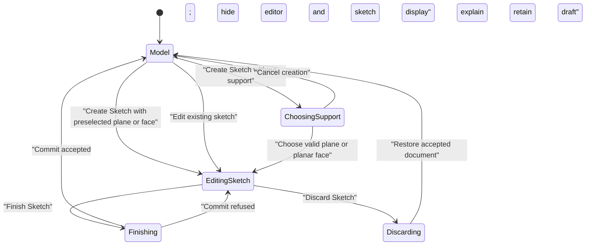
```mermaid
stateDiagram-v2
  [*] --> Model
  Model --> ChoosingSupport: "Create Sketch without support"
  Model --> EditingSketch: "Create Sketch with preselected plane or face"
  Model --> EditingSketch: "Edit existing sketch"
  ChoosingSupport --> EditingSketch: "Choose valid plane or planar face"
  ChoosingSupport --> Model: "Cancel creation"
  EditingSketch --> Finishing: "Finish Sketch"
  Finishing --> Model: "Commit accepted; hide editor and sketch display"
  Finishing --> EditingSketch: "Commit refused; explain and retain draft"
  EditingSketch --> Discarding: "Discard Sketch"
  Discarding --> Model: "Restore accepted document"
```

### 4.3 Tool and one-use lifecycle

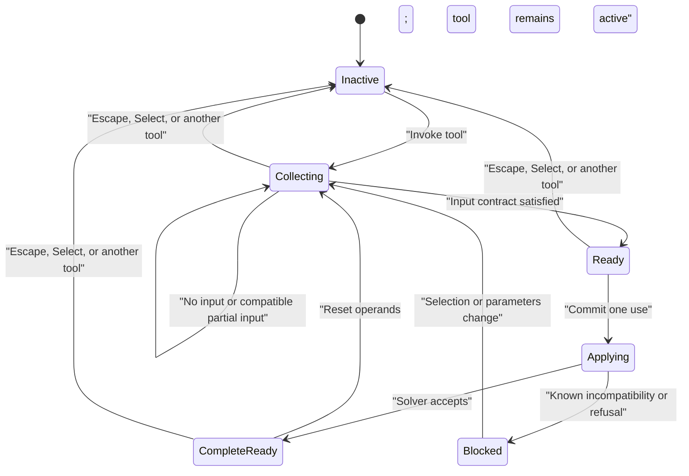
```mermaid
stateDiagram-v2
  [*] --> Inactive
  Inactive --> Collecting: "Invoke tool"
  Collecting --> Collecting: "No input or compatible partial input"
  Collecting --> Ready: "Input contract satisfied"
  Ready --> Applying: "Commit one use"
  Applying --> CompleteReady: "Solver accepts"
  Applying --> Blocked: "Known incompatibility or refusal"
  CompleteReady --> Collecting: "Reset operands; tool remains active"
  Blocked --> Collecting: "Selection or parameters change"
  Collecting --> Inactive: "Escape, Select, or another tool"
  Ready --> Inactive: "Escape, Select, or another tool"
  CompleteReady --> Inactive: "Escape, Select, or another tool"
```

`CompleteReady` is a real, visible state, even when it lasts only until the next
pointer action. It communicates “that use succeeded; this tool is still active.”

## 5. Tool capability manifest

Every sketch command SHOULD be data-driven by a manifest equivalent to:

```yaml
id: distance
family: dimension
repeatPolicy: repeat_after_commit
preselection: consume_compatible
inputs:
  - alternatives:
      - [line]
      - [point, point]
      - [curve, curve]
placement: dimension_label
value:
  kind: length
  required: true
exit:
  escape: exit_tool
  selectTool: exit_tool
  anotherTool: switch_tool
cursor:
  waiting: dimension
  validTarget: dimension_valid
  invalidTarget: invalid
enablement:
  workspace: editingSketch
  disabledWhenSelectionProvesImpossible: true
```

### 5.1 Repeat policies

| Policy | Behavior | Examples |
| --- | --- | --- |
| `repeat_after_commit` | Reset operands and remain active | Line, Circle, Rectangle, Dimension, most constraints, Trim, Project |
| `continue_chain` | Last result endpoint becomes next use's first input | Polyline/Line chain |
| `single_shot` | Complete and return to Select | Rare dialog-like transformations when repetition is unsafe |
| `toggle_modifier` | Changes creation mode without replacing active create tool | Construction, automatic constraints |

### 5.2 Input contract examples

| Tool | Compatible preselection | Incomplete state | Satisfied state |
| --- | --- | --- | --- |
| Distance | One line; two points; two compatible curves | One point or no selection | Contract alternative complete |
| Radius | One circle or arc | No selection | One round entity |
| Angle | Two non-collinear lines | Zero or one line | Two lines |
| Horizontal | One line | No selection | One line |
| Coincident | Two points; point plus origin | Zero or one point | Valid pair |
| Trim | One curve/shape segment plus cursor location | No target or non-trimmable target | Valid bounded trim plan |
| Offset | One or more offsettable curves plus distance | No curves | At least one compatible curve |
| Fillet/Chamfer | Two intersecting or extendable lines plus value | One line | Valid corner pair |
| Project | One external edge/reference | No external reference | Projectable reference |

## 6. Entry and support-selection flows

### 6.1 Create a new sketch

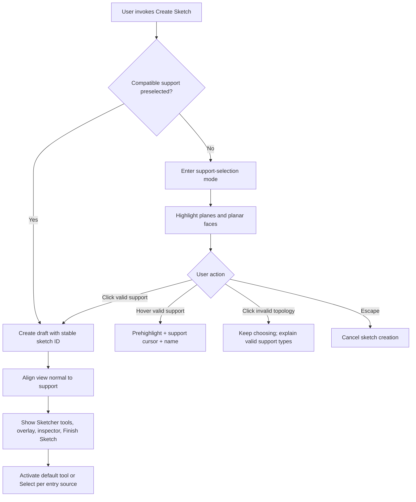
```mermaid
flowchart TD
  A["User invokes Create Sketch"] --> B{"Compatible support preselected?"}
  B -- Yes --> C["Create draft with stable sketch ID"]
  B -- No --> D["Enter support-selection mode"]
  D --> E["Highlight planes and planar faces"]
  E --> F{"User action"}
  F -- "Hover valid support" --> G["Prehighlight + support cursor + name"]
  F -- "Click valid support" --> C
  F -- "Click invalid topology" --> H["Keep choosing; explain valid support types"]
  F -- Escape --> I["Cancel sketch creation"]
  C --> J["Align view normal to support"]
  J --> K["Show Sketcher tools, overlay, inspector, Finish Sketch"]
  K --> L["Activate default tool or Select per entry source"]
```

### 6.2 Edit an existing sketch

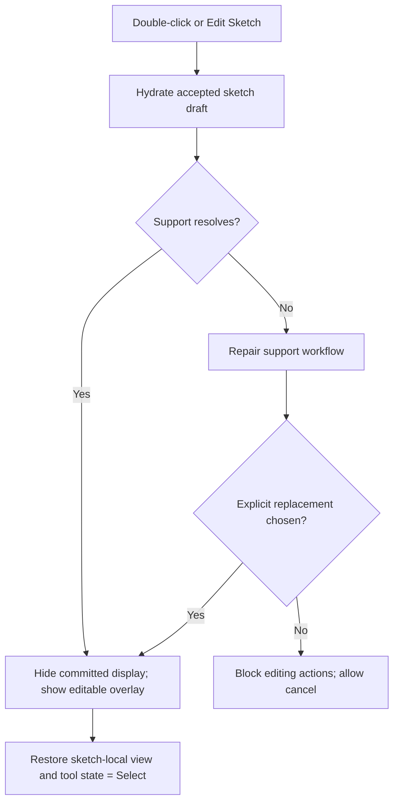
```mermaid
flowchart TD
  A["Double-click or Edit Sketch"] --> B["Hydrate accepted sketch draft"]
  B --> C{"Support resolves?"}
  C -- Yes --> D["Hide committed display; show editable overlay"]
  C -- No --> E["Repair support workflow"]
  E --> F{"Explicit replacement chosen?"}
  F -- Yes --> D
  F -- No --> G["Block editing actions; allow cancel"]
  D --> H["Restore sketch-local view and tool state = Select"]
```

## 7. Selection and enablement flows

### 7.1 Preselection and tool invocation

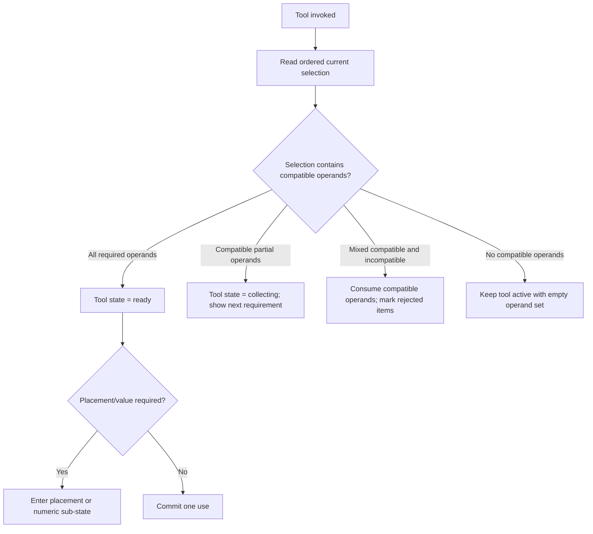
```mermaid
flowchart TD
  A["Tool invoked"] --> B["Read ordered current selection"]
  B --> C{"Selection contains compatible operands?"}
  C -- "All required operands" --> D["Tool state = ready"]
  C -- "Compatible partial operands" --> E["Tool state = collecting; show next requirement"]
  C -- "Mixed compatible and incompatible" --> F["Consume compatible operands; mark rejected items"]
  C -- "No compatible operands" --> G["Keep tool active with empty operand set"]
  D --> H{"Placement/value required?"}
  H -- Yes --> I["Enter placement or numeric sub-state"]
  H -- No --> J["Commit one use"]
```

### 7.2 Tool-first postselection

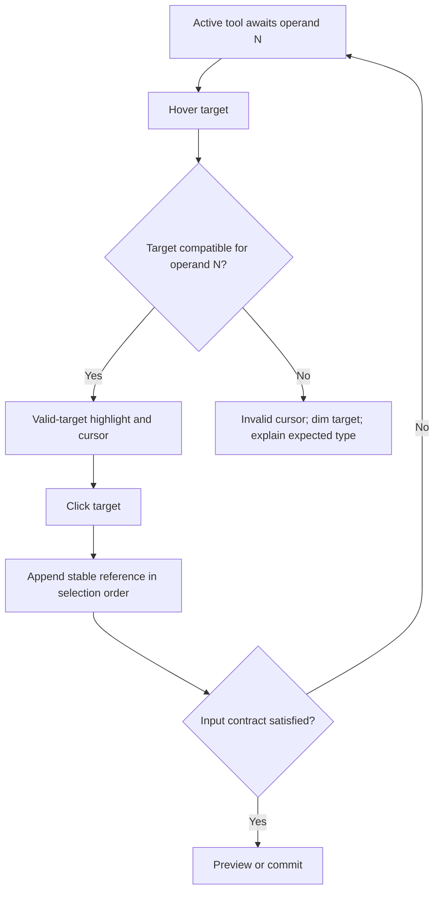
```mermaid
flowchart TD
  A["Active tool awaits operand N"] --> B["Hover target"]
  B --> C{"Target compatible for operand N?"}
  C -- Yes --> D["Valid-target highlight and cursor"]
  C -- No --> E["Invalid cursor; dim target; explain expected type"]
  D --> F["Click target"]
  F --> G["Append stable reference in selection order"]
  G --> H{"Input contract satisfied?"}
  H -- No --> A
  H -- Yes --> I["Preview or commit"]
```

### 7.3 Greying and disabling decision

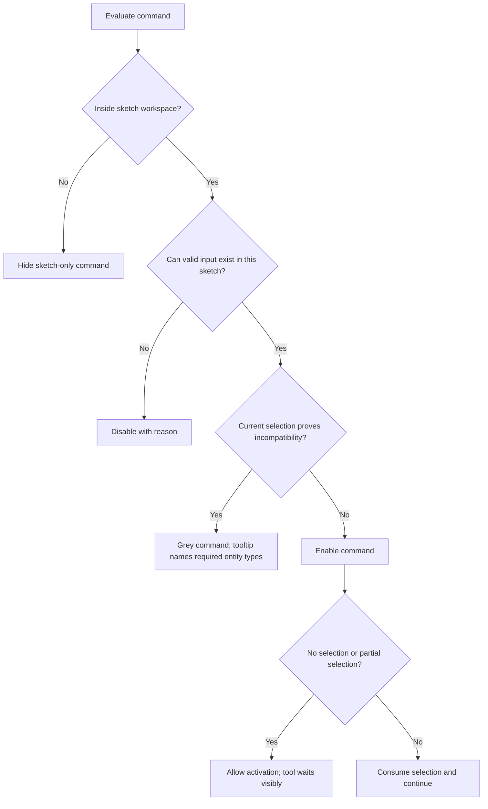
```mermaid
flowchart TD
  A["Evaluate command"] --> B{"Inside sketch workspace?"}
  B -- No --> C["Hide sketch-only command"]
  B -- Yes --> D{"Can valid input exist in this sketch?"}
  D -- No --> E["Disable with reason"]
  D -- Yes --> F{"Current selection proves incompatibility?"}
  F -- Yes --> G["Grey command; tooltip names required entity types"]
  F -- No --> H["Enable command"]
  H --> I{"No selection or partial selection?"}
  I -- Yes --> J["Allow activation; tool waits visibly"]
  I -- No --> K["Consume selection and continue"]
```

Rules:

- No selection MUST NOT disable Dimension or Constraint tools that can collect
  targets after activation.
- A selected line MAY enable Distance, Horizontal, Vertical, Offset, and other
  line-compatible tools while disabling Radius.
- A selected circle MAY enable Radius, Diameter, Concentric, Tangent, Equal,
  and Offset while disabling line-only commands.
- A disabled ribbon item and its flyout duplicate MUST share the same disabled
  state and explanation.
- An active tool MUST remain visually active even when its partial inputs are
  currently insufficient.

## 8. Geometry creation flows

### 8.1 Fixed-point-count geometry

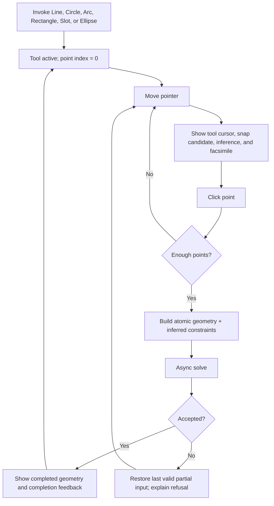
```mermaid
flowchart TD
  A["Invoke Line, Circle, Arc, Rectangle, Slot, or Ellipse"] --> B["Tool active; point index = 0"]
  B --> C["Move pointer"]
  C --> D["Show tool cursor, snap candidate, inference, and facsimile"]
  D --> E["Click point"]
  E --> F{"Enough points?"}
  F -- No --> C
  F -- Yes --> G["Build atomic geometry + inferred constraints"]
  G --> H["Async solve"]
  H --> I{"Accepted?"}
  I -- Yes --> J["Show completed geometry and completion feedback"]
  J --> B
  I -- No --> K["Restore last valid partial input; explain refusal"]
  K --> C
```

### 8.2 Continuous line chain

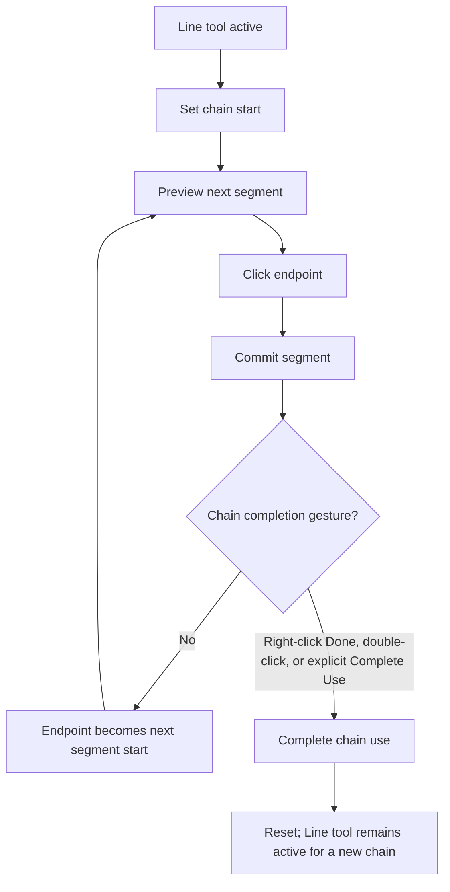
```mermaid
flowchart TD
  A["Line tool active"] --> B["Set chain start"]
  B --> C["Preview next segment"]
  C --> D["Click endpoint"]
  D --> E["Commit segment"]
  E --> F{"Chain completion gesture?"}
  F -- No --> G["Endpoint becomes next segment start"]
  G --> C
  F -- "Right-click Done, double-click, or explicit Complete Use" --> H["Complete chain use"]
  H --> I["Reset; Line tool remains active for a new chain"]
```

Crawler MAY support both isolated-line and continuous-chain modes, but the
active tool and one chain use MUST remain separate states.

### 8.3 Numeric entry while drawing

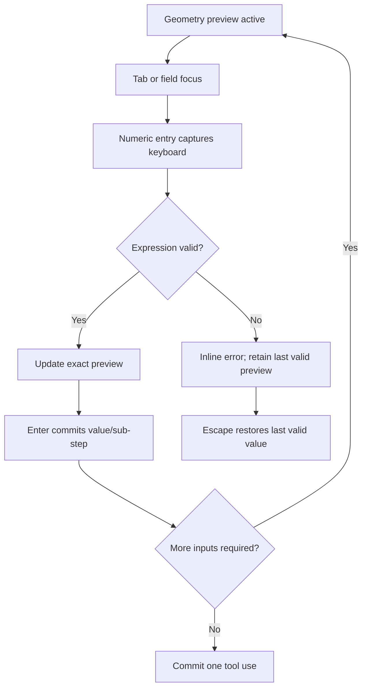
```mermaid
flowchart TD
  A["Geometry preview active"] --> B["Tab or field focus"]
  B --> C["Numeric entry captures keyboard"]
  C --> D{"Expression valid?"}
  D -- No --> E["Inline error; retain last valid preview"]
  D -- Yes --> F["Update exact preview"]
  F --> G["Enter commits value/sub-step"]
  E --> H["Escape restores last valid value"]
  G --> I{"More inputs required?"}
  I -- Yes --> A
  I -- No --> J["Commit one tool use"]
```

## 9. Constraint and dimension flows

### 9.1 Generic geometric constraint

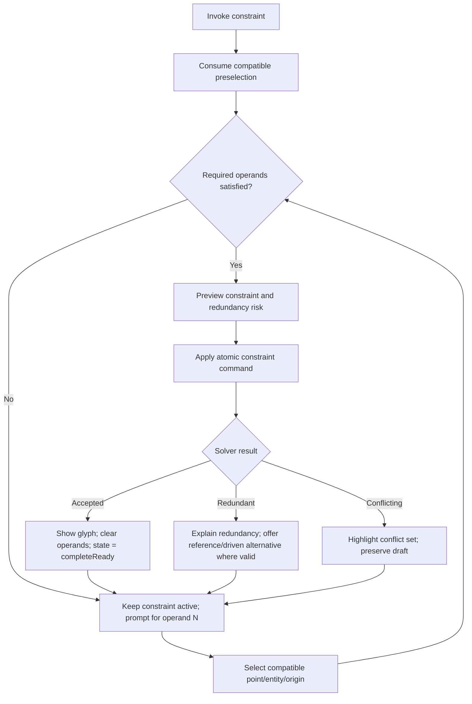
```mermaid
flowchart TD
  A["Invoke constraint"] --> B["Consume compatible preselection"]
  B --> C{"Required operands satisfied?"}
  C -- No --> D["Keep constraint active; prompt for operand N"]
  D --> E["Select compatible point/entity/origin"]
  E --> C
  C -- Yes --> F["Preview constraint and redundancy risk"]
  F --> G["Apply atomic constraint command"]
  G --> H{"Solver result"}
  H -- Accepted --> I["Show glyph; clear operands; state = completeReady"]
  I --> D
  H -- Redundant --> J["Explain redundancy; offer reference/driven alternative where valid"]
  H -- Conflicting --> K["Highlight conflict set; preserve draft"]
  J --> D
  K --> D
```

### 9.2 Smart dimension dispatch

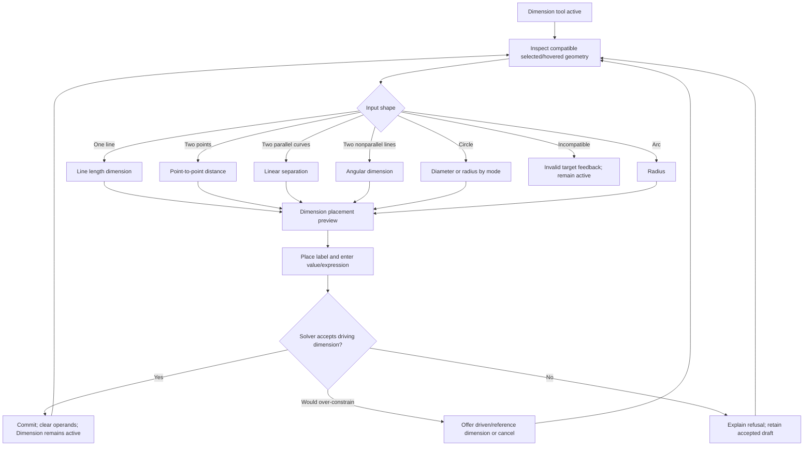
```mermaid
flowchart TD
  A["Dimension tool active"] --> B["Inspect compatible selected/hovered geometry"]
  B --> C{"Input shape"}
  C -- "One line" --> D["Line length dimension"]
  C -- "Two points" --> E["Point-to-point distance"]
  C -- "Two parallel curves" --> F["Linear separation"]
  C -- "Two nonparallel lines" --> G["Angular dimension"]
  C -- "Circle" --> H["Diameter or radius by mode"]
  C -- "Arc" --> I["Radius"]
  C -- "Incompatible" --> J["Invalid target feedback; remain active"]
  D --> K["Dimension placement preview"]
  E --> K
  F --> K
  G --> K
  H --> K
  I --> K
  K --> L["Place label and enter value/expression"]
  L --> M{"Solver accepts driving dimension?"}
  M -- Yes --> N["Commit; clear operands; Dimension remains active"]
  M -- "Would over-constrain" --> O["Offer driven/reference dimension or cancel"]
  M -- No --> P["Explain refusal; retain accepted draft"]
  N --> B
  O --> B
  P --> B
```

### 9.3 Edit an existing dimension

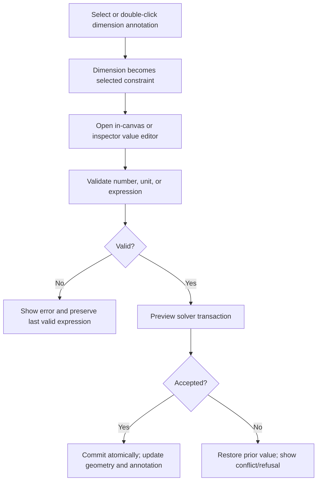
```mermaid
flowchart TD
  A["Select or double-click dimension annotation"] --> B["Dimension becomes selected constraint"]
  B --> C["Open in-canvas or inspector value editor"]
  C --> D["Validate number, unit, or expression"]
  D --> E{"Valid?"}
  E -- No --> F["Show error and preserve last valid expression"]
  E -- Yes --> G["Preview solver transaction"]
  G --> H{"Accepted?"}
  H -- Yes --> I["Commit atomically; update geometry and annotation"]
  H -- No --> J["Restore prior value; show conflict/refusal"]
```

## 10. Modify, trim, construction, and project flows

### 10.1 Selection-driven modify tool

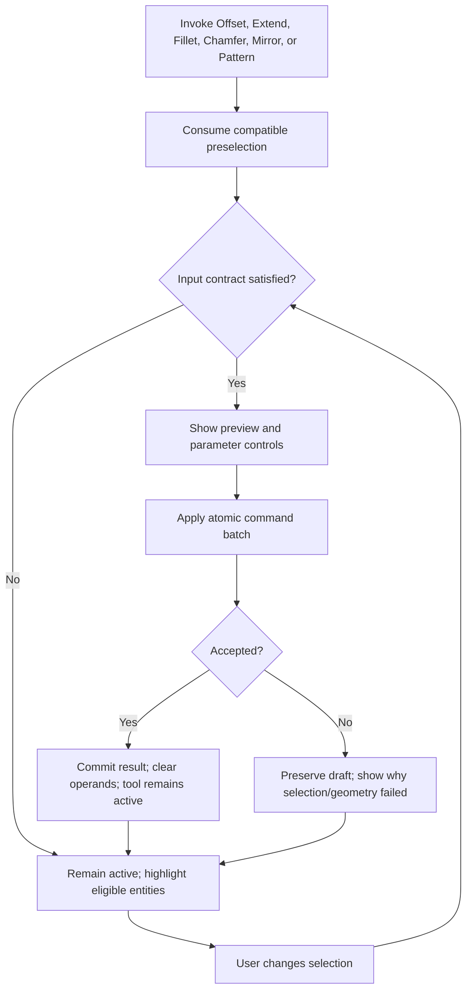
```mermaid
flowchart TD
  A["Invoke Offset, Extend, Fillet, Chamfer, Mirror, or Pattern"] --> B["Consume compatible preselection"]
  B --> C{"Input contract satisfied?"}
  C -- No --> D["Remain active; highlight eligible entities"]
  D --> E["User changes selection"]
  E --> C
  C -- Yes --> F["Show preview and parameter controls"]
  F --> G["Apply atomic command batch"]
  G --> H{"Accepted?"}
  H -- Yes --> I["Commit result; clear operands; tool remains active"]
  H -- No --> J["Preserve draft; show why selection/geometry failed"]
  I --> D
  J --> D
```

### 10.2 Trim

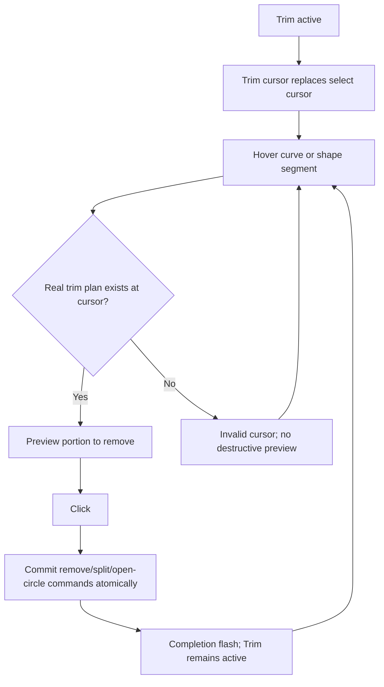
```mermaid
flowchart TD
  A["Trim active"] --> B["Trim cursor replaces select cursor"]
  B --> C["Hover curve or shape segment"]
  C --> D{"Real trim plan exists at cursor?"}
  D -- Yes --> E["Preview portion to remove"]
  D -- No --> F["Invalid cursor; no destructive preview"]
  E --> G["Click"]
  G --> H["Commit remove/split/open-circle commands atomically"]
  H --> I["Completion flash; Trim remains active"]
  I --> C
  F --> C
```

### 10.3 Construction geometry

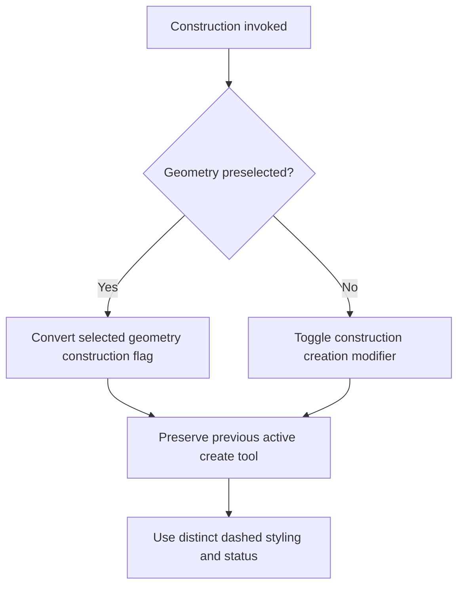
```mermaid
flowchart TD
  A["Construction invoked"] --> B{"Geometry preselected?"}
  B -- Yes --> C["Convert selected geometry construction flag"]
  B -- No --> D["Toggle construction creation modifier"]
  C --> E["Preserve previous active create tool"]
  D --> E
  E --> F["Use distinct dashed styling and status"]
```

Construction SHOULD behave as a modifier/conversion, not accidentally replace
the active geometry tool unless the explicit command is “Construction Line.”

### 10.4 Project external geometry

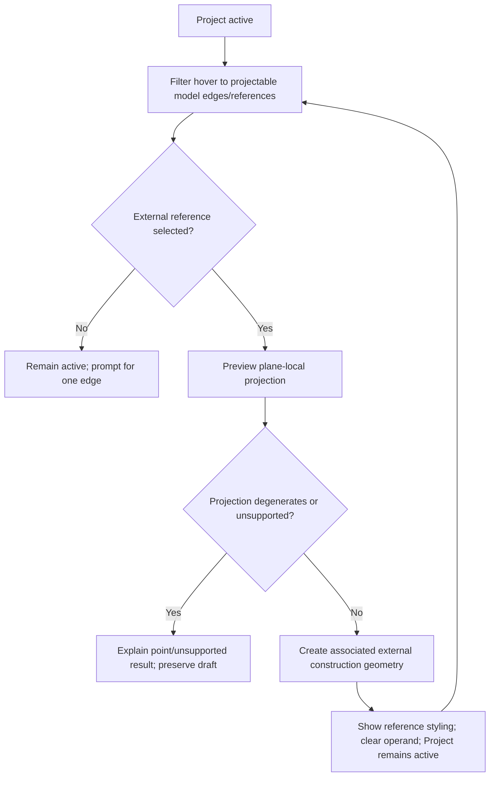
```mermaid
flowchart TD
  A["Project active"] --> B["Filter hover to projectable model edges/references"]
  B --> C{"External reference selected?"}
  C -- No --> D["Remain active; prompt for one edge"]
  C -- Yes --> E["Preview plane-local projection"]
  E --> F{"Projection degenerates or unsupported?"}
  F -- Yes --> G["Explain point/unsupported result; preserve draft"]
  F -- No --> H["Create associated external construction geometry"]
  H --> I["Show reference styling; clear operand; Project remains active"]
  I --> B
```

## 11. Cursor and visual-state contract

| ID | Pointer state | Cursor / visual treatment | When |
| --- | --- | --- | --- |
| `PTR-SELECT` | Select | Arrow; eligible items prehighlight | No active tool |
| `PTR-DRAW` | Draw | Crosshair plus tool badge/facsimile | Point-driven creation |
| `PTR-CONSTRAINT` | Constraint | Constraint badge/cell cursor; eligible operands highlighted | Geometric constraint active |
| `PTR-DIMENSION` | Dimension | Dimension/ruler badge; placement preview | Dimension active |
| `PTR-TRIM` | Trim | Trim/scissor/X badge; removable portion preview | Trim active |
| `PTR-MODIFY` | Modify | Copy/offset/operation badge | Selection-driven edit active |
| `PTR-PROJECT` | Project | Link/project badge; model-edge filter | Project active |
| `PTR-SNAP` | Snap/inference | Base cursor plus snap glyph, label, and guide | Valid inferred relation |
| `PTR-INVALID` | Invalid | Not-allowed cursor; target dimmed; reason in status | Incompatible target |
| `PTR-BUSY` | Applying | Progress cursor; inputs locked but viewport remains stable | Worker/solver transaction |
| `PTR-DRAG` | Drag | Grab/grabbing | Direct manipulation |
| `PTR-BOX` | Box select | Containment/crossing selection rectangle | Select mode drag on empty canvas |

The active ribbon button, flyout item, inspector header, workspace dataset, and
cursor MUST derive from the same state. They MUST NOT disagree about which tool
is active.

### 11.1 Tool visual phases

| Tool state | Required visible signal |
| --- | --- |
| `collecting` | Active button + “Waiting for …” + operand progress |
| `ready` | Stronger active highlight + preview/ready message |
| `applying` | Busy state + locked duplicate invocation |
| `completeReady` | Brief success treatment + “ready to use again” |
| `blocked` | Error treatment + actionable reason; active state retained |
| `inactive` | No pressed state; Select cursor |

## 12. Escape, Enter, right-click, and tool switching

### 12.1 Escape ladder

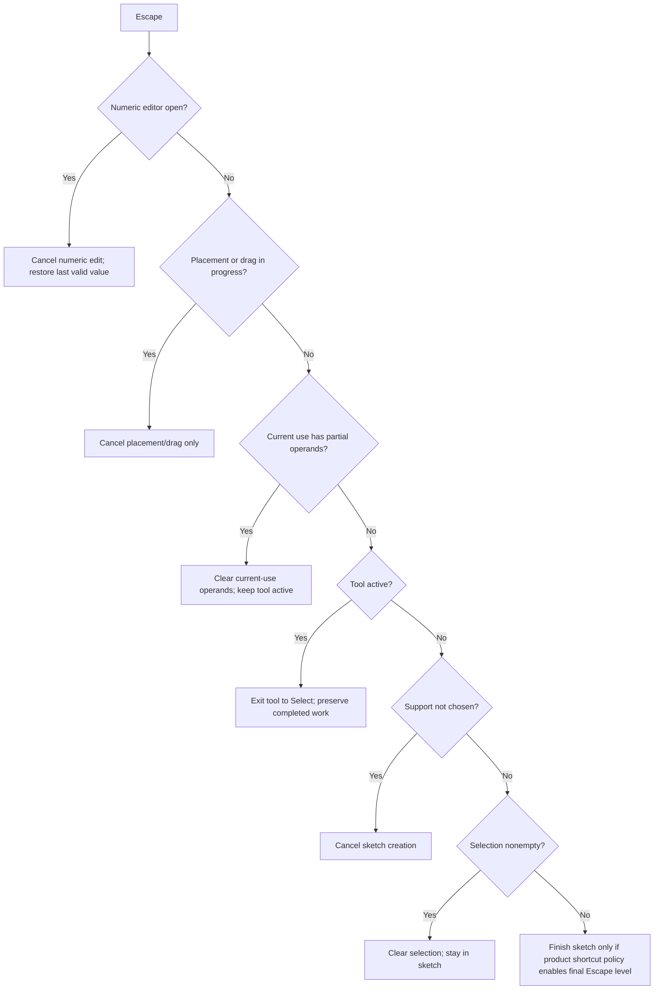
```mermaid
flowchart TD
  A["Escape"] --> B{"Numeric editor open?"}
  B -- Yes --> C["Cancel numeric edit; restore last valid value"]
  B -- No --> D{"Placement or drag in progress?"}
  D -- Yes --> E["Cancel placement/drag only"]
  D -- No --> F{"Current use has partial operands?"}
  F -- Yes --> G["Clear current-use operands; keep tool active"]
  F -- No --> H{"Tool active?"}
  H -- Yes --> I["Exit tool to Select; preserve completed work"]
  H -- No --> J{"Support not chosen?"}
  J -- Yes --> K["Cancel sketch creation"]
  J -- No --> L{"Selection nonempty?"}
  L -- Yes --> M["Clear selection; stay in sketch"]
  L -- No --> N["Finish sketch only if product shortcut policy enables final Escape level"]
```

The explicit Finish Sketch button is always the unambiguous terminal action.
If the final Escape level is enabled, operation status MUST say “Escape backs
out one level,” and each prior level MUST be observable.

### 12.2 Enter

| Context | Enter behavior |
| --- | --- |
| Numeric field | Validate and commit field/sub-step |
| Dimension placement/value | Commit one dimension use; tool remains active |
| Continuous chain | Complete current chain use; tool remains active |
| Tool with ready preview | Commit one use |
| Sketch idle / Select | MAY invoke Finish Sketch if explicitly documented in shortcut help |

### 12.3 Right-click

- During a continuous or batch tool, right-click SHOULD expose `Done`, `Cancel
  current use`, and context-relevant alternatives.
- In Select mode, right-click SHOULD expose sketch workspace actions including
  Finish Sketch and Discard Sketch.
- A quick right-click gesture MAY act as `Done` where consistent with platform
  conventions, but MUST not ambiguously discard the sketch.

### 12.4 Switching tools

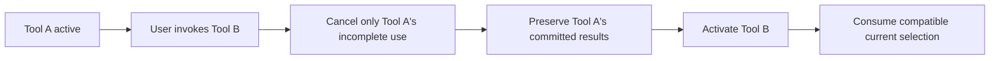
```mermaid
flowchart LR
  A["Tool A active"] --> B["User invokes Tool B"]
  B --> C["Cancel only Tool A's incomplete use"]
  C --> D["Preserve Tool A's committed results"]
  D --> E["Activate Tool B"]
  E --> F["Consume compatible current selection"]
```

## 13. Finish and discard flows

### 13.1 Finish Sketch

```mermaid
sequenceDiagram
  participant U as User
  participant UI as Sketch UI
  participant S as Sketch Session
  participant W as Worker/Solver
  participant R as Renderer
  U->>UI: Finish Sketch
  UI->>UI: Cancel incomplete tool use and deactivate tool
  UI->>S: Commit draft
  S->>W: Validate/solve/serialize transaction
  alt accepted
    W-->>S: accepted durable sketch
    S-->>UI: committed
    UI->>R: remove editable overlay and hide finished sketch display
    UI->>UI: restore prior workbench/view/focus
    UI->>UI: hide Finish Sketch controls
  else refused
    W-->>S: diagnostics
    S-->>UI: rejected
    UI->>UI: keep workspace and draft active; show repair action
  end
```

### 13.2 Discard Sketch

```mermaid
sequenceDiagram
  participant U as User
  participant UI as Sketch UI
  participant S as Sketch Session
  participant R as Renderer
  U->>UI: Discard Sketch
  UI->>UI: If destructive scope is ambiguous, request confirmation
  UI->>S: Cancel session and restore accepted snapshot
  S-->>UI: restored
  UI->>R: remove overlay; restore committed model display and view
  UI->>UI: return to previous workbench/focus
```

## 14. Solver and failure feedback

### 14.1 Solver feedback loop

```mermaid
flowchart TD
  A["Accepted sketch mutation"] --> B["Solve"]
  B --> C{"State"}
  C -- Under-constrained --> D["Show remaining DOF and movable entity feedback"]
  C -- Fully constrained --> E["Show fully constrained style and zero DOF"]
  C -- Over-constrained --> F["Highlight redundant/over-defining constraints"]
  C -- Conflicting --> G["Highlight minimal conflict set and reason"]
  C -- Failed --> H["Restore prior draft; show local recovery"]
  D --> I["Refresh profiles, annotations, and command enablement"]
  E --> I
  F --> I
  G --> I
  H --> I
```

### 14.2 Failure requirements

- Degenerate geometry: explain the overlap/zero-size cause and keep the tool at
  the last valid input step.
- Incompatible selection: name required entity types and retain the active tool.
- Over-defining dimension: offer driven/reference mode when supported.
- Worker refusal: preserve the accepted draft, operand references, and active
  tool when retry is safe.
- Missing external reference: block mutation, show rebind candidates, and never
  silently retarget.
- Async double-submit: while `applying`, prevent a second commit and expose busy
  state on both pinned and flyout command surfaces.

## 15. Accessibility and input parity

1. Every pressed tool MUST expose `aria-pressed="true"`.
2. Applying tools MUST expose `aria-busy="true"`.
3. Unavailable commands MUST use native `disabled` where possible and provide a
   nearby or tooltip reason.
4. Cursor-only states MUST have a text equivalent in the inspector/status area.
5. Solver color states MUST include text/glyph equivalents.
6. Canvas operands MUST be keyboard-selectable in deterministic order.
7. Focus MUST move to the active tool when invoked from command search and
   return to the invoking control after Finish/Discard.
8. Escape and Enter behavior MUST be identical whether a command was invoked
   from ribbon, flyout, shortcut, context menu, or command search.

## 16. Implementation event contract

### 16.1 Canonical events

| Event | Payload | Reducer outcome |
| --- | --- | --- |
| `SKETCH_ENTER_REQUESTED` | support/sketch reference | Choose support or hydrate draft |
| `SKETCH_SUPPORT_HOVERED` | stable support ref | Prehighlight only |
| `SKETCH_SUPPORT_ACCEPTED` | stable support ref | Enter editing workspace |
| `TOOL_INVOKED` | tool ID, source | Activate and consume preselection |
| `OPERAND_HOVERED` | stable ref, screen point | Validate target and update cursor |
| `OPERAND_SELECTED` | stable ref, modifiers | Append/toggle ordered operand |
| `POINT_ACCEPTED` | plane-local point, inference refs | Advance creation use |
| `VALUE_CHANGED` | field, expression | Validate and preview |
| `TOOL_USE_COMMIT_REQUESTED` | invocation ID | Lock inputs and submit atomic command(s) |
| `TOOL_USE_ACCEPTED` | result IDs, solve result | CompleteReady then reset operands |
| `TOOL_USE_REFUSED` | diagnostics | Preserve draft; Blocked/Collecting |
| `ESCAPE_REQUESTED` | focused layer | Back out one level |
| `TOOL_EXIT_REQUESTED` | reason | Cancel incomplete use; Select mode |
| `SKETCH_FINISH_REQUESTED` | sketch ID | Commit then close workspace |
| `SKETCH_DISCARD_REQUESTED` | sketch ID | Restore accepted snapshot then close |

### 16.2 State projection contract

The following surfaces MUST be projections of the same controller state:

```text
active tool ID
  -> pinned ribbon button
  -> flyout command row
  -> command-search result
  -> inspector tool tab/header
  -> viewport cursor and target filter
  -> operand progress/instruction
  -> keyboard shortcut routing
  -> operation/status message
```

No surface may independently toggle its own notion of “active.”

## 17. Acceptance scenarios

### Core lifecycle

- **UX-E2E-001:** Given no sketch workspace, Finish Sketch is absent/hidden.
- **UX-E2E-002:** Given a preselected planar face, Create Sketch enters directly
  on that support.
- **UX-E2E-003:** Given no support, Create Sketch enters support selection and
  rejects non-planar topology with visible feedback.
- **UX-E2E-004:** Finish Sketch commits, exits Sketcher, removes the editable
  overlay, hides the just-finished sketch, and restores view/focus.
- **UX-E2E-005:** Discard restores the accepted document without committing the
  session draft.

### Tool persistence

- **UX-E2E-010:** A completed Line leaves Line active and ready for a new line.
- **UX-E2E-011:** A Dimension invoked with no selection stays active and prompts
  for its first operand.
- **UX-E2E-012:** A Dimension invoked with one selected line immediately creates
  a line-length dimension, then remains active with zero operands.
- **UX-E2E-013:** A two-point constraint retains its first point after the first
  click and completes only after a compatible second point.
- **UX-E2E-014:** After a constraint commits, its button remains pressed and the
  inspector says it is ready to use again.
- **UX-E2E-015:** Escape first cancels a partial use, then exits the active tool;
  committed geometry remains.

### Enablement and feedback

- **UX-E2E-020:** With a selected line, Radius is disabled while Distance is
  enabled.
- **UX-E2E-021:** Clearing selection re-enables tools that can collect operands
  after activation.
- **UX-E2E-022:** Pinned and flyout copies share disabled, pressed, busy, and
  completion state.
- **UX-E2E-023:** Clicking an incompatible target displays the required operand
  type and does not exit the tool.
- **UX-E2E-024:** Every active family has a distinct cursor state.

### Solver and failure

- **UX-E2E-030:** An over-defining dimension does not mutate the accepted draft
  and exposes remediation.
- **UX-E2E-031:** A degenerate geometry retry retains the last valid partial
  point and active tool.
- **UX-E2E-032:** During async apply, duplicate submission is disabled and busy
  state is visible.
- **UX-E2E-033:** Under/fully/over/conflicting states are available as text and
  are not communicated by color alone.

## 18. Source register

### SOLIDWORKS — first-party

- [Sketch overview and entry](https://help.solidworks.com/2025/english/solidworks/sldworks/c_Sketch.htm)
- [Editing an existing sketch](https://help.solidworks.com/2025/english/solidworks/sldworks/t_Editing_an_Existing_Sketch.htm)
- [Exiting sketches](https://help.solidworks.com/2025/English/SolidWorks/sldworks/t_Exiting_Sketches.htm)
- [Selection Filter toolbar and pointer feedback](https://help.solidworks.com/2025/english/SolidWorks/sldworks/r_selection_filter_selection.htm)
- [Inferencing](https://help.solidworks.com/2026/English/SolidWorks/sldworks/c_Inferencing.htm)
- [Trim to closest](https://help.solidworks.com/2025/english/solidworks/sldworks/t_Trimming_with_Trim_to_Closest.htm)
- [Sketch status conventions](https://help.solidworks.com/2021/english/solidworks/sldworks/c_Sketch_Status_Conventions.htm)
- [Sketch options and entity colors](https://help.solidworks.com/2026/english/SolidWorks/Sldworks/HIDD_OPTIONS_SKETCH.htm)
- [Dimensions and relations](https://help.solidworks.com/2015/english/Solidworks/sldworks/c_dimensions_top.htm)

### Autodesk Fusion — first-party

- [Edit a sketch](https://help.autodesk.com/cloudhelp/ENU/Fusion-Sketch/files/GUID-0EEF7073-6CDE-4E31-AF1A-0811F969F031.htm)
- [Sketches in Fusion](https://help.autodesk.com/cloudhelp/ENU/Fusion-Sketch/files/SKT-3D-SKETCH.htm)
- [Create lines](https://help.autodesk.com/cloudhelp/ENU/Fusion-Sketch/files/SKT-CREATE-LINES.htm)
- [Dimension sketch geometry](https://help.autodesk.com/cloudhelp/ENU/Fusion-Sketch/files/SKT-CREATE-DIMENSIONS.htm)
- [Finish a sketch](https://help.autodesk.com/cloudhelp/ENU/Fusion-Sketch/files/SKT-FINISH-SKETCH.htm)
- [Dimension tutorial showing persistent active tool](https://help.autodesk.com/cloudhelp/ENU/Fusion-Sketch/files/GUID-0A723EF7-0A93-45D0-ADAE-15FFF09E5C15.htm)
- [Selection filters](https://help.autodesk.com/cloudhelp/ENU/Fusion-Model/files/SLD-SELECTION-FILTERS.htm)
- [Project reference](https://help.autodesk.com/cloudhelp/ENU/Fusion-Sketch/files/GUID-6EE7B230-A280-45B7-8868-D96E4CE44B62.htm)
- [Marking menu and contextual OK/Cancel](https://help.autodesk.com/cloudhelp/ENU/Fusion-GetStarted/files/GUID-6514ABC1-CB75-4F0B-AB0E-316FAD36BA93.htm)

### Autodesk Inventor — first-party

- [Create, edit, cancel, and finish sketches](https://help.autodesk.com/cloudhelp/2026/ENU/Inventor-Help/files/GUID-E96FB3C4-136B-4551-BF45-F54594543ECB.htm)
- [Work with sketch dimensions](https://help.autodesk.com/cloudhelp/2026/ENU/Inventor-Help/files/GUID-026FE8D3-AFBB-4834-BC18-73D9CFF78185.htm)
- [Apply geometric constraints](https://help.autodesk.com/cloudhelp/2026/ENU/Inventor-Help/files/GUID-A85A7A30-7D81-4C75-8769-CAD034EEA930.htm)
- [Project geometry into a 2D sketch](https://help.autodesk.com/cloudhelp/2026/ENU/Inventor-Help/files/GUID-B8D8B07B-86F2-4CB7-AB21-3131D94AD1CC.htm)
- [About sketch constraints, inference, DOF, and driven dimensions](https://help.autodesk.com/cloudhelp/2022/ENU/Inventor-Help/files/GUID-FAF69614-E8F2-4763-975C-552E0BEA1DD1.htm)
- [Automatic dimensions and constraints](https://help.autodesk.com/cloudhelp/2022/ENU/Inventor-Help/files/GUID-1DC71C6F-9F6D-4846-8E73-9CB7D3452882.htm)
- [Constraint display and over-constraint feedback](https://help.autodesk.com/cloudhelp/2025/ENU/Inventor-Help/files/GUID-B06FA7B7-5CD5-4D58-B1C5-0C5ABAFFD84E.htm)

### Plasticity — first-party

- [Selection Mode](https://doc.plasticity.xyz/plasticity-essentials/plasticity-interface/selection-mode)
- [Dimension](https://doc.plasticity.xyz/common/dimension)
- [Command Bar and Suggested Commands](https://doc.plasticity.xyz/plasticity-essentials/plasticity-interface/command-bar)
- [Line](https://doc.plasticity.xyz/tool/line)
- [Trim](https://doc.plasticity.xyz/sketch/trim)
- [Sketching Essentials](https://doc.plasticity.xyz/tool/sketching-essentials)
- [Snap](https://doc.plasticity.xyz/plasticity-essentials/plasticity-interface/snap)

## 19. Implemented Crawler policy decisions

These policies resolve the previously open choices while preserving the
orthogonal state model so they can still evolve independently:

1. Line defaults to a continuous connected chain. Enter or contextual
   right-click completes the current chain without finishing the workspace.
2. Escape cancels a partial use, then exits the active tool, then stops at
   Select. It never accepts or finishes a valid sketch implicitly.
3. Contextual right-click `Done` directly completes the current command use;
   the inspector also exposes an explicit Apply action for staged previews.
4. A rejected driving dimension exposes an explicit **Add as reference**
   remediation. Conversion is never silent or automatic.
5. Selecting a committed sketch shows it and makes it the edit target; entering
   sketch edit remains an explicit command.
6. Invoking or preparing a 3D feature does not implicitly finish the sketch.
   **Finish Sketch** is the only accepting workspace exit.

The implementation contract for these policies is centralized in
`web/crawler-app/src/sketch-tool-manifest.ts` rather than duplicated per ribbon
button.
