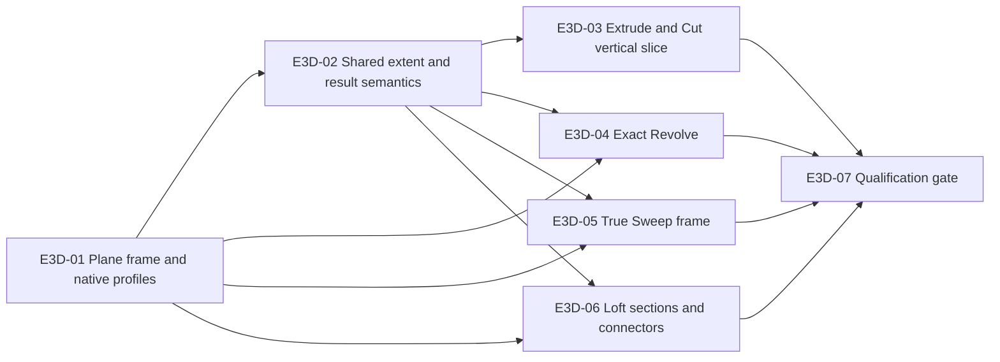

# Solid Feature Modernization Initiative Backlog

- Status: active multi-sprint initiative; Sprint 1, Sprint 2, bounded Sprint 3 revision 2, and bounded Sprint 4 revision 1 **QUALIFIED** for their frozen scopes
- Planning date: 2026-08-25
- Product surface: part workspace, feature inspector, worker/WASM runtime, feature kernel, and portable document
- Parent backlog: [E05 — Solid feature modeling](../BACKLOG.md#e05--solid-feature-modeling)
- Current sprint: [Single-Target Blind Cut — Sprint 5](solid-feature-modernization-sprint-5.md)
- Current sprint state: Sprint 5 scope is frozen for one explicit current same-component target, qualified origin/offset/current-planar-face supports and line/arc/circle/hole profiles, Blind Forward/Reverse/Symmetric, retained target-body identity, and native/release-WASM/browser/performance qualification; implementation, candidate manifest, evidence, and qualification remain pending
- Most recent qualified sprint: [Planar-Face Extrude and Explicit Support Repair — Sprint 4](solid-feature-modernization-sprint-4.md), qualified for its frozen boundary after automated qualification, isolated immutable-bundle validation, and fresh independent zero-finding review
- Qualified baseline: [Solid Feature Foundations — Sprint 1](solid-feature-modernization-sprint.md)
- Competitive references: SolidWorks, Autodesk Fusion, and Plasticity solid-feature workflows

## 1. Initiative objective

Replace Crawler's demo-level solid commands with a coherent, editable feature
foundation and deliver one production-shaped vertical slice through Extrude and
Cut. The same contracts must make Revolve, Sweep, and Loft incrementally
implementable without creating another command-specific path.

The initiative is successful when a modeler can select a closed region on an origin
plane, construction plane, or planar face; create or cut a body using an exact,
editable Extrude; save and reload the part; edit the feature's inputs and extent;
and obtain the same deterministic result after recompute. Revolve, Sweep, and
Loft then adopt the same qualified contracts through the prioritized vertical
slices identified below.

Sprint 1 is intentionally narrower than the initiative outcome: it implements
positive blind New Body Extrude on an origin plane. Sprint 2 has implemented
and qualified Reverse and Symmetric for that same origin-plane New Body
boundary after automated and independent zero-finding gates.
Sprint 3 revision 1 automated-passed the signed origin-relative offset
construction-plane subset, but independent review rejected that bundle.
Revision 2 contains the resulting remediations and is qualified for its frozen
boundary after the complete automated gate, isolated bundle validation, and a
fresh independent review with zero findings.
Sprint 4 revision 1 produced an initial mechanically passing automated bundle
for analytic planar-face-supported Blind New Body Extrude and explicit
compatible repair on the same body, producer, and component, but independent
review rejected that evidence with nine findings. A first remediated revision 1
bundle passed the 27/27 automated gate, but independent review found one
remaining cross-language fail-closed persistence defect. After that defect was
fixed, the exact post-fix source passed another complete 27/27 source-bound gate
and isolated bundle validation. Independent exact-state review rejected that
newest bundle because Rust accepted noncanonical decimal kernel IDs and unknown
fallback-signature keys that TypeScript and storage reject. After Rust was made
equally fail closed, the exact remediated source passed a complete 28/28
source-bound gate and isolated bundle validation. Attempt 31 independently
rejected that bundle because the persisted `external_line` sketch element did
not share the same Rust/TypeScript/storage contract. The document and storage
remediations now pass 11/11 and 19/19 focused tests. Attempt 33's broader audit
then found five additional persisted-ID
paths. Crawler-sketch is remediated at 3/3, while the advanced-request,
WASM/native-evidence, alpha-raw-evidence, and history-test findings require
completion before the full rerun. Attempt 34 closes those paths in focused
verification. A first full rerun then failed on sandbox `C:\Volta` resolution, and a
second reached mandatory native/release-WASM parity before two repair evidence
documents exposed different broken-reference sentinels. Attempt 38 aligns the
native sentinel to canonical `u64::MAX` and passes focused 10/10 parity.
Attempt 39 subsequently passed all 26 executable gates through production
browser but failed the mandatory preflight source-snapshot comparison because
the four tracked completion documents changed during execution. Attempt 40
reran a stable 870-file source snapshot and passed 28/28 commands, 10/10
native/release-WASM parity, browser 2/2, both performance workloads with zero
violations, and isolated immutable-bundle validation. Its 35 passed records and
163 checksum entries are sealed at
`artifacts/solid-feature-qualification/runs/20260829T123714Z-solid-feature-sprint-4-r1`.
Fresh independent Attempt 41 reviewed the exact source, contracts, harnesses,
immutable bundle, and completion documents and returned standalone `ZERO
FINDINGS`. The bounded Sprint 4 scope is therefore **QUALIFIED**. The same
reviewer completed final documentation-only Attempt 42, including the
reconciled documents and `git diff --check`, and returned exact standalone
`ZERO FINDINGS`. Sprint 4 bounded closeout is complete; next-tranche selection
is pending.
Arbitrary, angled, tangent, three-point, and face-derived datum
planes; curved or nonanalytic supports; broader support rebinding; Cut, Revolve,
Sweep, and Loft remain follow-on tranches. The optional Sprint 1 Sweep/Loft
capability spike was not promoted and carries no completion claim.

This plan does not define parity as a matching set of toolbar labels. A feature
is complete only when its native inputs, output semantics, edit behavior,
failure behavior, history identity, and qualification workload are all covered.

## 2. Current baseline

Crawler already provides useful infrastructure:

- worker-hosted, non-mutating preview and atomic commit;
- durable feature, body, parameter, and dependency identities;
- structured errors, cancellation, suppression, undo/redo, and save/reload;
- sketch profile recognition and topology-aware viewport selection;
- native feature-kernel contracts for polygon Extrude, Revolve, Loft, Sweep,
  Boolean, edge treatments, Shell, Mirror, Transform, and Pattern.

The initiative's remaining blocking gaps after the automated-passed Sprint 4
revision 1 candidate are:

1. The bounded analytic planar-face Blind New Body Extrude path and same-owner
   explicit repair are covered by Sprint 4 automated evidence, but other
   topology-supported features, curved or nonanalytic supports, and non-offset
   construction-plane sketches remain unsupported outside that candidate
   boundary.
2. Sketch placement still lacks generalized angled, arbitrary-axis, tangent,
   three-point, and topology-derived world-space frame evaluation.
3. Unsupported analytic/spline profile families and legacy operation paths
   still lack the exact durable modeling path already qualified for line, arc,
   and circle regions.
4. Add, join, cut, intersect, and new-body behavior is fragmented by command.
5. Extrude still lacks independent two-side values, start offsets, target
   termination, and other advanced extent modes beyond qualified blind
   Forward/Reverse/Symmetric.
6. Sweep translates a fixed profile along path points instead of orienting it to
   the path tangent.
7. Loft has implicit polygon correspondence and no connectors, rails, or
   boundary continuity.
8. Loft and Sweep advertise editing while exposing no editable parameters or
   input rebinding.

## 3. Program scope, priority, and sizing

### 3.1 Priority

| Priority | Initiative meaning |
|---|---|
| P0 | Required for the first production-shaped solid-feature vertical slice or to prevent a new architectural dead end |
| P1 | Required for the next competitive modeling tranche after the first vertical slice |
| P2 | Advanced scope specified early so later work does not improvise incompatible semantics |

### 3.2 Relative sizing

| Size | Meaning |
|---|---|
| S | Narrow change with an established implementation pattern and focused coverage |
| M | Cross-layer change or new interaction with bounded geometry behavior |
| L | Kernel, schema, runtime, UI, and persistence work requiring a vertical slice |
| XL | Must be decomposed or time-boxed behind an explicit technical gate before sprint commitment |

Sizes are relative planning inputs, not elapsed-time estimates. The team should
convert them to its normal point scale during sprint planning.

### 3.3 Delivery tranches

This initiative is intentionally broader than one sprint. Delivery is split as
follows:

- Sprint 1 delivers the capability gates, typed durable definitions, plane and
  exact-profile foundations, a bounded Extrude vertical slice, and an auditable
  qualification harness defined in the linked current-sprint document.
- Sprint 2 adopts those foundations for durable Forward/Reverse/Symmetric blind
  New Body Extrude on origin planes. It is a bounded subset and does not complete
  the older E3D-S1-09 angled/construction-plane acceptance boundary.
- Sprint 3 adds only signed, origin-relative offset construction planes and
  origin-aware blind New Body Extrude from them. Angled and planar-face support
  remain later work, so Sprint 3 does not complete E3D-01-S02.
- Sprint 4 adds only current analytic planar-face-supported Blind New Body
  Extrude plus explicit compatible repair on the same body, producer, and
  component. Its automated qualification passed, but final qualification
  remains gated by independent exact-state review. Curved/nonanalytic supports,
  automatic healing, split/merge or topology-changing repair, and generalized
  rebinding remain later work, so Sprint 4 does not complete E3D-01-S02.
- Later tranches continue unified Extrude/Cut and Revolve after their support,
  target-selection, and release-WASM Boolean prerequisites are qualified.
- Later tranches replace Sweep and Loft geometry, then add their advanced
  orientation, rail, continuity, thin, and surface modes.

No tranche may add visible controls ahead of the corresponding kernel, document,
edit, compatibility, and qualification semantics. XL stories in this initiative
must be decomposed into sprint-sized stories before commitment.

### 3.4 Current tranche status

- Gate 0 permits exact line/arc/circle New Body Extrude and explicitly excludes
  Join/Cut from Sprint 1; see
  `docs/qualification/solid-feature-gate0.md`.
- Candidate revision 3 remediated all five revision 2 audit findings while
  retaining the nine P0 story IDs and correcting the E3D-S1-11 UI boundary. Its
  automated gate passed across content-bound source identity, portable evidence,
  document/kernel/runtime, generated release WASM, legacy goldens, parity,
  production browser, and performance, but the fresh independent audit rejected
  qualification for one remaining evidence gap: the browser workflow did not
  exercise the accepted compatible selected-region replacement during timeline edit.
- The superseded revision 3 bundle remains immutable historical evidence at
  `artifacts/solid-feature-qualification/runs/20260826T094412Z-solid-feature-sprint-1-r3`.
- Revision 4 closed that gap without changing acceptance or deferred scope. Its
  distinct replacement region in the stored source sketch/support passed cancel
  and commit, original/replacement references, retained feature/body identity,
  expected geometry, recompute, and reload. The complete automated gate passed
  all 25 commands, application tests 213/213, worker tests 13/13, parity 15/15,
  comparator self-tests 7/7, non-parity self-tests 6/6, and production browser
  5/5.
- The revision 4 automated bundle is immutable at
  `artifacts/solid-feature-qualification/runs/20260826T105732Z-solid-feature-sprint-1-r4`.
- The revision 4 independent audit rejected completion because a selected profile
  from another sketch/support could enter timeline replacement despite that
  boundary being deferred. Revision 5 requires the exact stored source sketch ID
  and two ready, equal resolved frames. An incompatible selection blocks with an
  explicit source-sketch/resolved-support reason before preview or commit, with
  zero dispatch and unchanged accepted hash, references, feature/body IDs,
  bounds, and count through recompute/reload.
- Revision 5 passed its automated gate at
  `artifacts/solid-feature-qualification/runs/20260826T115242Z-solid-feature-sprint-1-r5`:
  all 25 commands, application 214/214, worker 13/13, parity 15/15, comparator
  7/7, non-parity 6/6, and production browser 6/6 across all four manifest IDs.
  The fresh independent review reported zero findings and satisfied the Sprint 1
  completion gate. Cross-sketch replacement and support rebinding remain deferred
  and blocked. The broader Extrude/Cut, Revolve, Sweep, Loft, advanced extent,
  result-mode, reference-chip, construction-plane, and planar-face tranches remain
  active and unqualified.
  The live ledger and retained finding/remediation history are in
  `docs/qualification/solid-feature-sprint-qualification.md`.
- Planar-face placement, non-offset construction-plane recipes, and the
  E3D-S1-03 Sweep/Loft decision remain deferred rather than partially complete.
- Sprint 3 candidate revision 1 passed its complete automated gate at
  `artifacts/solid-feature-qualification/runs/20260828T111633Z-solid-feature-sprint-3-r1`.
  All 25/25 commands passed, producing 28 passed records and 121 checksummed
  files against build `solid-feature-sprint-3-r1-20260828` and generated
  release-WASM SHA-256
  `5b2b656fce6efb81cadff92f71521610159a87f019925e5ba782f83d9f968177`.
  Web units passed 226/226, worker tests passed 13/13, native and release-WASM
  fixture oracles passed 4/4 each, parity passed 4/4 with zero differences, and
  production browser passed 2/2. All three locked workloads completed two
  warmups, ten measured samples, and 50 edit/cancel cycles with zero violations.
  Independent review subsequently rejected that immutable bundle for
  evidence-integrity, dependency/recompute, typed-diagnostic, numeric-boundary,
  UI/worker protocol, selection, atomicity, and production-reachability
  findings. Revision 1 is superseded historical evidence and is not a basis for
  qualification.
- Sprint 3 candidate revision 2 remediates executed lifecycle evidence; real
  preview operations; typed UI/worker diagnostics at the boundaries actually
  tested; suppression/null protocol that removes the candidate datum preview
  and blocks dependent recompute while preserving the last accepted
  body/packet/hash;
  selection clearing; transitive topological recompute; exact zero offset;
  wrong-type and unsafe offsets at the exact
  `±9,007,199,254,740,991` nanometer bound; missing/suppressed/invalid support;
  reachable existing-plane missing-parameter editing; repaired-runtime
  identity evidence; native/WASM sequence and category alignment; checked
  BigInt scaling; atomic commit preflight; equality of tested offset-plane
  tool-first/selection-first request fields and typed plane/parameter ID shapes;
  and production generated-worker lifecycle comparison of selection-first/tool-first
  unique-profile Extrude preview bindings. The Extrude comparison retains the
  same accepted semantic hash, stable sketch ID/geometry IDs, explicit
  `profileGeometryIds`, exact construction-plane support, direction, and
  nanometer distance while newly allocated feature/body/transaction values
  differ with matching typed ID shapes. Construction-plane datum selection
  clears selected feature, sketch, and explicit profile context; the browser
  asserts the exact empty Extrude selection context before tool-first launch,
  whose unique-profile resolution emits explicit `profileGeometryIds`. The
  shared edit helper accepts direction-sensitive `Distance` and symmetric
  `Total length` input labels. Plane suppression removes the candidate datum preview
  and blocks dependent recompute without posting an empty replacement packet,
  retaining the last accepted body/packet/hash until valid recompute.
  The focused production browser check passed 1/1 in 17.3 seconds. The complete
  source-bound browser/full automated gate remains pending.
  Missing base, parameter, and support faults cross the real worker/runtime;
  wrong-type coverage is a typed UI-boundary injection backed by real native/
  release-WASM fixtures. Invalid dependency is rejected on `load`; the invalid
  document is not saved or reopened. The unchanged last-valid accepted document
  is saved/reopened before valid dependency repair, and no invalid runtime
  reaches preview.
- At that prequalification checkpoint, revision 2 was **not qualified** and had
  no qualifying automated bundle. A complete source-frozen gate, isolated
  immutable-bundle validation, and then a fresh zero-finding independent review
  remained required. All six
  revision 1 attempts, findings, remediations, and unchanged deferrals remain
  append-only in
  `docs/qualification/solid-feature-sprint-3-qualification.md`.
- Sprint 3 candidate revision 2 subsequently passed all 25/25 logged commands in
  immutable run
  `artifacts/solid-feature-qualification/runs/20260828T135258Z-solid-feature-sprint-3-r2`.
  Application units passed 232/232, worker tests 13/13, parity self-tests 11/11,
  non-parity self-tests 6/6, native/release-WASM fixture parity 9/9, and
  production browser 2/2. Both oracle validators, candidate QualificationReady
  validation, and isolated bundle validation passed; the bundle contains 33
  records and 141 checksummed files. Runtime build
  `solid-feature-sprint-3-r2-20260828` locks generated WASM SHA-256
  `865834b5265f23d7ba2348549a93b5d44613a0fd52a34778b3b274ba609a4499`
  and manifest SHA-256
  `97bf837d2c8d8031252acc93484e9e4372d69e3dcee5ba3f6d17aef76267b545`.
  The 584-file source snapshot and dirty-source hash are both
  `e2501912b71848beb3ec70a2640446d6abc9f17bcf09da40d0940304fe79e96f`.
  Locked performance recorded zero violations and a 0 ms maximum Long Task:
  origin rectangle preview 52.3/54.0 ms p50/p95, recompute 11.9/16.6 ms,
  cancel max 56.7 ms, heap growth 1,466,100 bytes; annulus 52.8/57.1 ms,
  21.2/30.2 ms, 57.3 ms, and heap growth 1,667,588 bytes; offset-plane
  rectangle 46.8/56.0 ms, 11.7/19.9 ms, 62.1 ms, and heap growth 1,672,728
  bytes. The decision is
  **AUTOMATED QUALIFICATION PASSED — INDEPENDENT REVIEW PENDING**. Sprint 3 is
  **NOT YET QUALIFIED**, and all explicit deferrals remain unchanged.
- On 2026-08-28, the mandatory independent reviewer audited the exact revision 2
  source, contracts, tests, isolated immutable bundle, and completion documents
  and returned exact **ZERO FINDINGS**. Sprint 3 revision 2 is therefore
  **QUALIFIED** for only its frozen offset-plane and blind New Body Extrude
  boundary. The immutable run, counts, hashes, validators, and performance
  evidence above remain unchanged; revision 1 remains rejected history.
  Explicit deferrals remain unchanged and unqualified:
  angled/arbitrary/tangent/three-point/face-derived planes; support rebinding;
  cross-support profile replacement; two-side/start/target extents;
  Join/Cut/Intersect; handles/taper/thin; Revolve/Sweep/Loft. No deferred work
  is implied to be qualified.
- Sprint 4 revision 1 subsequently passed the complete source-bound automated
  gate and isolated immutable-bundle validation in
  `artifacts/solid-feature-qualification/runs/20260829T052403Z-solid-feature-sprint-4-r1`.
  All 25/25 commands passed, producing 35 records and 160 checksummed files for
  the frozen analytic planar-face Blind New Body Extrude and same-body,
  same-producer, same-component explicit repair boundary. This automated pass
  does not close the independent exact-state review gate and therefore is not
  yet a final Sprint 4 qualification claim.
- The mandatory independent review then rejected that initial Sprint 4 bundle
  with nine findings covering the durable reference shape, planar circle/hole
  and transform-round-trip coverage, declared owner-mismatch execution,
  independent geometry oracles, command provenance, truthful test mappings,
  unobscured screenshots, and stale completion wording. The run remains
  historical evidence; the nine findings and their remediations remain in the
  append-only Sprint 4 qualification ledger.
- The remediated Sprint 4 revision 1 source subsequently passed a fresh complete
  source-bound automated gate and isolated immutable-bundle validation in
  `artifacts/solid-feature-qualification/runs/20260829T075140Z-solid-feature-sprint-4-r1`.
  All 27/27 commands passed, producing 35 records and 162 checksummed files for
  analytic planar-face Blind New Body Extrude using qualified line, arc,
  circle, and hole profiles, current native/release-WASM frame authority, and
  explicit repair limited to a compatible support on the same body, producer,
  and component. Independent exact-state review rejected this first remediated
  bundle for one remaining TypeScript fail-closed mismatch: out-of-range `u64`
  stable identities and malformed fallback signatures could survive the web
  persistence boundary. This bundle remains immutable rejected history.
- The persistence boundary was aligned with the native contract, including the
  canonical `u64` maximum and strict fallback-signature validation. The exact
  post-fix source then passed another complete 27/27 source-bound automated gate
  and isolated immutable-bundle validation in
  `artifacts/solid-feature-qualification/runs/20260829T084448Z-solid-feature-sprint-4-r1`,
  again producing 35 records and 162 checksummed files with 10/10
  native/release-WASM parity fixtures, browser JUnit 2/2, eight unobscured
  screenshots, and zero performance-budget violations. Independent exact-state
  review rejected this bundle because Rust still admitted noncanonical decimal
  kernel IDs and unknown fallback-signature keys that the TypeScript document
  and storage boundaries rejected. This bundle remains immutable rejected
  history.
- Rust decimal topology identities and fallback signatures were then made to
  enforce the same canonical, exact shape as TypeScript and storage, and a
  separately logged `storage-mirror` gate was added. The exact remediated source
  passed all 28/28 commands and isolated immutable-bundle validation in
  `artifacts/solid-feature-qualification/runs/20260829T103331Z-solid-feature-sprint-4-r1`.
  The bundle contains 35 passed records and 163 checksummed files. It binds
  manifest SHA-256
  `2dd9a81be451d011792eb46ac86275da092f16a20302f14e17c5de4433e16f79`,
  source-content SHA-256
  `419dd8c4d9baa4f386b6cbebc0c406935e1a88f3c009780879304ad4a84b0a96`
  across 870 entries/files with zero deleted paths, Git commit
  `3f2ec88b4687c15cd8721f840ed21b293955f95e`, runtime build
  `solid-feature-sprint-4-r1-20260828`, release-WASM SHA-256
  `c8932ce766f9dd9e2e5e27f1fee8ad4fc462b21c3754297c66621cdd0b130c58`
  at 10,887,489 bytes, feature-kernel SHA-256
  `c1da7574b86b570b9ce3e8ef07c0e3b05c2f266003dd2b3ceca5283abb272c00`,
  and operation-catalog SHA-256
  `ad5673ef974112e631a3813894496449f9d02eedfefbb51e22f4c3cf679aad1d`.
  Ten native and ten release-WASM fixtures passed with
  10/10 zero-difference parity; application units passed 237/237, document and
  storage mirrors passed 8/8 and 16/16, worker tests passed 13/13, parity and
  non-parity self-tests passed 15/15 and 6/6, production browser passed 2/2,
  and all eight screenshots are unobscured.
- Both locked workloads passed two warmups, ten measured samples, and 50
  edit/cancel cycles with zero budget violations and zero Long Tasks. Planar-
  face Extrude recorded preview p50/p95 50.9000000953674/56.6000001430511 ms,
  recompute p50/p95 17.2/22.7 ms, cancellation maximum 52 ms, and 1,342,896
  bytes heap growth. Support repair recorded preview p50/p95
  62.5/112.799999952316 ms, recompute p50/p95
  133.299999952316/203.299999952316 ms, cancellation maximum
  35.7000000476837 ms, 860,652 bytes heap growth, one candidate, and 62 ranking
  observations. Attempt 31 rejected this evidence for final qualification.
- Attempt 31 proved that persisted `external_line` did not fail closed across
  all three persistence boundaries. Rust's strict `decimal_u64` rejected a JSON
  number, but the Attempt 30 TypeScript type/codec omitted the variant, reported
  `parsed: true`, and serialized it without `body` or `stable_kernel_id`;
  storage separately reported `stored: true` for the numeric identity. This
  adversarial parse/store acceptance plus lossy TypeScript round trip disproved
  the common persistence-domain claim. Attempt 30 remains immutable historical
  automated evidence but is **REJECTED FOR FINAL QUALIFICATION**.
- Focused remediation now enforces the exact six fields `kind`, `id`,
  `start_nanometers`, `end_nanometers`, `body`, and `stable_kernel_id` in both
  TypeScript document and storage protocols. Each coordinate is an exact pair
  of safe integers; the identity is a canonical decimal-string `u64`, including
  `0` and `u64::MAX`; numeric, noncanonical, out-of-range, missing, unknown, or
  malformed values fail closed; and serialization/package round trips retain
  all six fields without loss. Document protocol passes 11/11 and storage
  protocol passes 19/19. These are focused remediation results, not a qualifying
  bundle. A fresh complete source-bound no-waiver run, isolated validation,
  reconciled documents, and an independent exact-state review returning
  `ZERO FINDINGS` remain mandatory. Current state is **REJECTED — REMEDIATION
  IN PROGRESS** (not qualified).
- Attempt 33 broadened the persisted-topology-ID audit beyond `external_line`
  and recorded five findings. First, crawler-sketch `ExternalReference` used
  `parse::<u64>()` and admitted padded or signed decimal strings. Second,
  persisted advanced-feature request topology vectors still used JSON numbers.
  Third, the Sprint 4 release-WASM evidence adapter converted identities through
  `Number` while native evidence accepted numeric identities. Fourth,
  alpha-reference raw evidence represented the identity numerically. Fifth, a
  history regression test typed the persisted identity as a number.
- Advanced-feature operations remain functionally deferred, but their request
  persistence is shared infrastructure; functional deferral is not a waiver for
  malformed persisted IDs and is not a persistence waiver. Crawler-sketch now accepts only canonical decimal
  strings, proves `0` and `u64::MAX`, rejects padded, signed, empty, whitespace,
  numeric, and out-of-range forms, and passes 3/3 focused tests. Canonical-string
  remediation for the advanced-request vectors, Sprint 4 WASM/native evidence,
  alpha raw evidence, and history-test typing remains in progress. No fresh full
  bundle may begin until all five findings close. Current state is **REMEDIATION
  IN PROGRESS — FULL RERUN PENDING** (not qualified); a fresh complete
  source-bound no-waiver run, isolated bundle, reconciled documents, and
  independent exact-state `ZERO FINDINGS` review remain mandatory.
- Attempt 34 closes the Attempt 33 matrix at focused-remediation scope. Crawler-
  sketch remains 3/3. Feature-kernel topology-ID arrays for Draft, edge
  treatment, and Shell now use canonical string serialization and pass 29/29
  contracts plus 2/2 persistence tests. The application request builder passes
  20/20 plus TypeScript compilation, and runtime passes 2/2. Release-WASM
  preserves strings through `BigInt` and passes 1/1; native evidence enforces
  string-only identity and passes 1/1; alpha evidence passes 5/5; and the
  history regression type is corrected. Document 11/11 and storage 19/19 remain
  passing.
- These closures do not expand Sprint 4. Draft, edge treatments, Shell, and all
  other advanced-feature behavior remain functionally deferred; only their
  shared persistence contract was canonicalized. Focused success is not full
  qualification evidence. Current state is **REMEDIATION COMPLETE — FULL
  SOURCE-BOUND RERUN PENDING** (not qualified). The exact remediated source must
  pass the complete no-waiver gate, isolated immutable-bundle validation, and
  reconciled documentation before a fresh independent review may return the
  mandatory `ZERO FINDINGS` verdict.
- Attempt 35 records
  `artifacts/solid-feature-qualification/runs/20260829T113815838Z-incomplete`
  as an administrative archive of the completed Attempt 30 `current` mirror.
  Its old manifest/source identity, 28/28 commands, passing report, 35 records,
  and 163 checksum entries are not a new execution and remain rejected by
  Attempt 31.
- Attempt 36 records
  `artifacts/solid-feature-qualification/runs/20260829T115821960Z-incomplete`:
  current manifest
  `4bd4daa7110e5150e3e18157d5586b04ab93194c23c5abaa934507331e81e2d7`
  and source
  `3b1511f58c61d92ff568157bcb88dc6074fbd7851ee12b8841f0f2719a9942d3`
  across 870 files, rejected at application unit after 17/18 passing commands
  and 21 checksums because sandbox resolution of `C:\Volta` returned `EPERM`.
- Attempt 37 records
  `artifacts/solid-feature-qualification/runs/20260829T121358296Z-incomplete`:
  24/25 commands passed and 50 checksum entries were written before parity
  rejected the run at 8/10. Only the two repair fixtures' accepted-document
  hashes differed. Release-WASM correctly used full-range canonical `u64::MAX`
  for the deliberately broken reference; native evidence used another
  sentinel. No product-result comparison differed.
- Attempt 38 changes native `break_topology_reference` to
  `u64::MAX.to_string()`. Focused exports under
  `target/sprint4-focused-parity-20260829T121122215Z` produced ten native and
  ten generated release-WASM fixtures and passed the unchanged comparator
  10/10 with zero differences. This closed only the focused parity blocker.
- Attempt 39 is retained at
  `artifacts/solid-feature-qualification/runs/20260829T122635405Z-incomplete`.
  Its 26 recorded commands all passed through production browser, including
  10/10 native/release-WASM parity and browser 2/2, but the mandatory preflight
  source-integrity comparison rejected the run before indexing or report
  finalization. The start snapshot was
  `d5520d32d15ac939f15bbd5a3448b772441f0a89e8809a338155978375455c32`;
  the four tracked completion documents changed during execution. The archive
  has 64 checksum entries and no qualification report or immutable completion
  claim.
- Attempt 40 reran the stable exact source and passed 28/28 commands plus
  post-copy isolated validation. Immutable run
  `artifacts/solid-feature-qualification/runs/20260829T123714Z-solid-feature-sprint-4-r1`
  binds manifest SHA-256
  `4bd4daa7110e5150e3e18157d5586b04ab93194c23c5abaa934507331e81e2d7`
  to source-content SHA-256
  `f4f01a45db55c2626a36c7a161db6da788e62b650cbc73efb1035ca0d87a76f6`
  across 870 files with zero deletions. It contains 35 passed records, 163
  checksum entries, 10/10 zero-difference parity, browser 2/2, eight
  unobscured screenshots, and zero performance-budget violations. Current
  state at that checkpoint was **AUTOMATED PASS — INDEPENDENT REVIEW PENDING**
  (not qualified).
- Attempt 41 assigned a fresh independent reviewer to the exact Attempt 40
  source, contracts, repeatable harnesses, immutable bundle, and completion
  documents. The reviewer returned exact standalone `ZERO FINDINGS`; bounded
  Sprint 4 revision 1 is **QUALIFIED** for only its frozen scope. A final
  documentation-only re-review is still pending. No shortcoming, exclusion, or
  deferred feature class is promoted by this decision.
- Attempt 42 records the same reviewer's final documentation-only audit of the
  reconciled completion documents and `git diff --check`. The reviewer returned
  exact standalone `ZERO FINDINGS`. Bounded Sprint 4 revision 1 closeout is
  **COMPLETE AND QUALIFIED**; selection of the next dependency-ready
  unqualified tranche is pending. Every prior finding, shortcoming, exclusion,
  and deferral remains append-only and unchanged.
- Sprint 4 leaves the following scope explicitly deferred and unqualified:
  arbitrary, angled, tangent, three-point, and face-derived datum planes;
  curved or nonanalytic supports; automatic healing, split/merge or
  topology-changing rebind; cross-component, cross-support, or generalized
  rebind; independent two-side, start, or target extents; Join, Cut, Intersect,
  and target selection; model-space handles, draft, and thin features; and
  Revolve, Sweep, and Loft.

### Current implementation tranche — Sprint 4 planar-face Extrude

The current scope-frozen implementation tranche is
[Planar-Face Extrude and Explicit Support Repair — Sprint 4](solid-feature-modernization-sprint-4.md),
with append-only status in
[Solid Feature Sprint 4 Qualification](../qualification/solid-feature-sprint-4-qualification.md)
and candidate manifest `contracts/solid-feature-candidate/sprint-4.json`.
Revision 1's initial automated qualification and isolated immutable-bundle
validation mechanically passed in the 25/25-command, 35-record,
160-checksummed-file run at
`artifacts/solid-feature-qualification/runs/20260829T052403Z-solid-feature-sprint-4-r1`.
Independent review rejected that bundle with nine findings, which remain linked
with their remediations in the append-only qualification ledger. The remediated
revision 1 source then passed 27/27 commands in the fresh 35-record,
162-checksummed-file isolated bundle at
`artifacts/solid-feature-qualification/runs/20260829T075140Z-solid-feature-sprint-4-r1`.
Independent review rejected that first remediated bundle for the remaining
cross-language fail-closed persistence mismatch. After that P1 was fixed, the
post-fix source passed another 27/27-command, 35-record,
162-checksummed-file isolated bundle at
`artifacts/solid-feature-qualification/runs/20260829T084448Z-solid-feature-sprint-4-r1`.
Independent review rejected that second remediated bundle for the remaining
Rust versus TypeScript/storage fail-closed mismatch. After the Rust fix, the
exact source passed a 28/28-command, 35-record, 163-checksummed-file isolated
bundle at
`artifacts/solid-feature-qualification/runs/20260829T103331Z-solid-feature-sprint-4-r1`.
Attempt 31 rejected that bundle for the `external_line` Rust-versus-TypeScript/
storage mismatch and lossy TypeScript serialization. Exact six-field,
safe-coordinate-pair, canonical-`u64`, lossless document and storage remediation
now passes 11/11 and 19/19, but a fresh full source-bound bundle does not yet
exist. At the Attempt 31/32 checkpoint, Sprint 4 remained **REJECTED — REMEDIATION IN PROGRESS** and **not
qualified** until independent review of a fresh bundle returns `ZERO FINDINGS`.
Attempt 33 then found five further persisted-ID paths. Crawler-sketch canonical
identity now passes 3/3. Attempt 34 closes the remaining matrix: feature-kernel
29/29 plus 2/2, app builder 20/20 plus TypeScript compilation, runtime 2/2,
release-WASM/native evidence 1/1 each, alpha 5/5, corrected history typing, and
document/storage 11/11 and 19/19. Attempts 35–38 preserve the administrative
archive and the rejected environment/parity reruns before focused parity
closure. Attempt 39 then passed 26 recorded commands through browser but the
mandatory source-integrity check rejected its changing four-document snapshot.
Attempt 40 reran a stable snapshot and passed 28/28 commands plus isolated
validation in the 35-record, 163-checksum-entry immutable bundle at
`artifacts/solid-feature-qualification/runs/20260829T123714Z-solid-feature-sprint-4-r1`.
Attempt 41's fresh independent exact-state review returned standalone `ZERO
FINDINGS`, and the same reviewer returned standalone `ZERO FINDINGS` for final
documentation-only Attempt 42. Sprint 4 is **COMPLETE AND QUALIFIED** for its
frozen scope; next-tranche selection is pending. Its scope remains limited to analytic planar-face-
supported Blind New Body Extrude over qualified line, arc, circle, and hole
profiles plus explicit compatible repair on the same body, producer, and
component, under current native/release-WASM frame authority. Sprint 3 remains
qualified and its history is unchanged. Arbitrary/angled/tangent/three-point/
face-derived datum planes, curved/nonanalytic supports, auto healing,
split/merge/topology-changing rebind, cross-component/cross-support/general
rebind, two-side/start/target extents, Join/Cut/Intersect/targets, handles,
draft/thin, Revolve, Sweep, and Loft remain deferred.

### Selected implementation tranche — Sprint 5 single-target Blind Cut

On 2026-08-31 the next dependency-ready P0 tranche was frozen as
[Single-Target Blind Cut — Sprint 5](solid-feature-modernization-sprint-5.md),
with append-only planning state in
[Solid Feature Sprint 5 Qualification](../qualification/solid-feature-sprint-5-qualification.md).
The bounded result subtracts one qualified region from exactly one explicitly
selected, current target body in the same component, retains that body's stable
identity, creates no new body, and supports qualified origin, signed-offset,
and current analytic planar-face frames with Blind Forward/Reverse/Symmetric.

This selection advances the initiative's primary Extrude/Cut vertical slice
after Sprints 1–4 qualified its representative profile, direction, placement,
history, and release-WASM foundations. A conditional native/generated-release-
WASM Boolean-authority gate is mandatory; no inferred target, sampled fallback,
New Body fallback, or native-only completion is permitted.

The selection checkpoint is planning only. Candidate
`solid-feature-sprint-5` revision 1, its manifest, code, fixtures, tests,
artifacts, immutable bundle, and independent review remain unimplemented or
unproven. Join/Intersect; multi, implicit, or cross-component targets;
two-side/start/target and Through All/Next/Object extents; handles/draft/thin;
extra datum planes and curved/nonanalytic supports; generalized repair;
unqualified profile families; and Revolve/Sweep/Loft remain explicitly deferred
and unqualified.

## 4. Definition of ready

A story is ready when:

- all operation inputs and output modes have typed document and worker shapes;
- native kernel capability is confirmed or a bounded spike is named;
- supported and rejected geometry classes are explicit;
- fixtures name the support plane, profile type, target bodies, and expected
  topology or geometric measurements;
- editing, suppression, undo/redo, save/reload, and recompute expectations are
  stated for durable features;
- compatibility behavior is defined for existing saved polygon features; and
- the failure path specifies the accepted document and preview state that must
  remain unchanged.

## 5. Definition of done

Every completed story must satisfy the repository-wide backlog definition of
done plus these solid-feature requirements:

1. Authoritative geometry stays native; render tessellation is never reused as
   modeling input.
2. Preview and commit execute the same operation definition and differ only in
   transaction durability.
3. Tool-first and selection-first workflows resolve the same typed inputs.
4. Numeric entry and viewport manipulation update the same parameter identity.
5. `Enter` commits, `Escape` cancels, and cancellation leaves no durable entity.
6. Editing preserves the feature identity and unaffected downstream references.
7. Invalid geometry produces a structured, field-addressable error without
   replacing the last accepted body.
8. Undo/redo, save/reload, suppression, and deterministic recompute have
   automated coverage.
9. New schemas have compatibility fixtures and fail closed on unknown versions.
10. Browser coverage uses the generated release WASM rather than a TypeScript
    geometry substitute.

---

## E3D-01 — General planar profiles and native curve transport

**Outcome:** Every solid feature receives exact, support-independent profile
geometry in a complete world-space frame.

### E3D-01-S01 — Define a complete planar support frame

**Priority / Size:** P0 / M

**Depends on:** E00-S04, E04-S05

**Story:** As a feature developer, I need one canonical plane frame so a profile
has the same world-space placement whether it comes from an origin plane,
construction plane, or planar face.

**Acceptance criteria:**

- A versioned `PlaneFrame` or equivalent records origin, orthonormal X/Y axes,
  normal, handedness, and exact unit scale.
- Origin-plane, construction-plane, and planar-topology support resolve into the
  same representation.
- Plane-local points and vectors have deterministic local-to-world and
  world-to-local transforms.
- Invalid or degenerate frames fail with support-entity context.
- Canonical serialization and Rust/TypeScript round trips preserve exact values.

**Required evidence:** unit tests for all support kinds, transform round trips,
canonical fixture serialization, and fail-closed degenerate frames.

### E3D-01-S02 — Resolve construction-plane and planar-face sketches

**Priority / Size:** P0 / L

**Depends on:** E3D-01-S01, E03-S02, E06-S04

**Story:** As a modeler, I need solid features to accept sketches attached to
construction planes and planar faces so I can build beyond the global origin.

**Acceptance criteria:**

- Extrude, Cut, Revolve, Sweep, and Loft no longer reject a valid sketch solely
  because its support is not an origin plane.
- Offset and angled construction-plane origins are reflected in generated
  geometry.
- Face-supported sketches retain a stable topology reference and enter repair
  state when the support disappears.
- Rebinding a broken support previews the recovered feature before commit.
- Support edits dirty only the affected feature and descendants.

**Required evidence:** one offset-plane Extrude, one angled-plane Revolve, one
face-supported Cut, and one broken/repaired face-support browser workflow.

**Bounded Sprint 4 status (Attempt 42 closeout complete and qualified):**
The analytic planar-face Blind New Body Extrude subset over qualified line,
arc, circle, and hole profiles, current native/release-WASM frame authority,
and explicit compatible repair on the same body, producer, and component passed
the fresh complete source-bound gate and isolated bundle validation in
`artifacts/solid-feature-qualification/runs/20260829T103331Z-solid-feature-sprint-4-r1`
(28/28 commands, 35 records, 163 checksummed files), but Attempt 31 rejected it
for the `external_line` cross-language persistence mismatch. At that checkpoint,
focused document 11/11 and storage 19/19 remediation was installed and the next
full source-bound bundle was additionally gated on the five Attempt 33
persisted-ID findings.
Attempt 34 closes all five in the focused matrix: crawler-sketch 3/3;
feature-kernel 29/29 plus 2/2; app builder 20/20 plus TypeScript compilation;
runtime 2/2; WASM/native evidence 1/1 each; alpha 5/5; corrected history typing;
and document/storage 11/11 and 19/19. Attempts 35–37 retain the administrative
old-current archive, the sandbox-resolution rejection at 17/18, and the parity
rejection at 24/25 with 8/10 fixtures. Attempt 38 aligns native broken-reference
evidence to canonical `u64::MAX` and passes focused 10/10 native/release-WASM
parity under `target/sprint4-focused-parity-20260829T121122215Z`. Attempt 39
passed its 26-command prefix but was rejected when the mandatory source snapshot
check observed concurrent completion-document changes. Attempt 40 passed the
stable 28/28 source-bound gate and isolated validation with 35 passed records
and 163 checksum entries at
`artifacts/solid-feature-qualification/runs/20260829T123714Z-solid-feature-sprint-4-r1`.
Attempt 41's fresh independent review returned standalone `ZERO FINDINGS`, and
the same reviewer returned standalone `ZERO FINDINGS` for final documentation-
only Attempt 42 after auditing the reconciled documents and `git diff --check`.
This bounded path is complete and qualified. This does not complete
E3D-01-S02: its angled-plane Revolve, face-supported Cut, other solid-feature
families, curved/nonanalytic supports, and generalized repair/rebind acceptance
remain open, and final Sprint 4 qualification remains review-gated.

### E3D-01-S03 — Introduce native curve and loop feature DTOs

**Priority / Size:** P0 / XL

**Depends on:** E3D-01-S01, Monstertruck curve/surface capability gate

**Story:** As a modeler, I need circles, arcs, ellipses, conics, and splines to
remain native through solid creation so downstream surfaces retain exact design
intent.

**Acceptance criteria:**

- The operation contract carries stable, ordered curve references or native
  curve definitions rather than fixed sampled point arrays.
- Lines, circles, arcs, ellipses, elliptical arcs, conics, B-splines, and
  fit-spline-derived native pieces are supported or rejected individually with
  explicit capability reasons.
- Loop orientation, parameter interval, seam, and support frame are canonical.
- Display tessellation tolerance cannot change committed solid geometry.
- A circular Extrude produces an analytic cylindrical surface where the kernel
  supports it; unsupported native cases fail rather than silently polygonizing.
- Existing polygon features remain readable through a versioned compatibility
  path without being mislabeled as native curves.

**Required evidence:** kernel contracts for line/arc, full circle, ellipse, and
spline loops; tolerance-invariance tests; document migration fixtures; STEP or
independent B-rep evidence for analytic output where available.

### E3D-01-S04 — Make regions and nested loops first-class inputs

**Priority / Size:** P0 / L

**Depends on:** E3D-01-S03, sketch profile identity

**Story:** As a modeler, I need to select the material regions I intend so holes,
islands, and multiple disjoint contours do not depend on hidden loop ordering.

**Acceptance criteria:**

- A region has a stable identity, outer loop, ordered inner loops, support
  frame, and source-sketch dependency.
- Multiple disjoint regions can be added to and removed from a feature input.
- Nested loops classify material and holes deterministically independent of
  entity creation order.
- Ambiguous, open, overlapping, or self-intersecting loops identify the
  offending sketch entities.
- Editing upstream geometry preserves region identity when topology is
  semantically unchanged and produces repair state otherwise.

**Required evidence:** annulus, plate with two holes, two disjoint bosses,
nested island, open-loop rejection, and topology-change repair fixtures.

### E3D-01-S05 — Qualify native profile bounds and tolerances

**Priority / Size:** P1 / M

**Depends on:** E3D-01-S03, E3D-01-S04

**Story:** As a feature developer, I need one tolerance policy so curve closure,
planarity, intersections, booleans, tessellation, and export do not apply
contradictory thresholds.

**Acceptance criteria:**

- Modeling, comparison, and display tolerances are distinct typed values.
- Document units and model scale produce bounded, documented defaults.
- Closure and planarity checks report the measured deviation and allowed bound.
- Changing display quality cannot alter feature validity or document hash.
- Near-tolerance fixtures behave identically in native and WASM execution.

**Required evidence:** scale-varied fixtures, near-closure cases, native/WASM
parity, and deterministic hash assertions.

---

## E3D-02 — Unified feature extent and result semantics

**Outcome:** Extrude, Revolve, Sweep, and Loft share predictable start, direction,
target-body, and output-operation behavior.

### E3D-02-S01 — Define unified result operation modes

**Priority / Size:** P0 / M

**Depends on:** E00-S05, E05-S03

**Story:** As a modeler, I need New Body, Join, Cut, and Intersect to be modes of
the feature I am creating so I do not have to switch to a separate command or
manually build temporary tools.

**Acceptance criteria:**

- One typed enum represents `new_body`, `join`, `cut`, and `intersect` across
  compatible feature operations.
- Result mode is stored on the durable feature and remains editable.
- Default mode is deterministic from the current body context and is always
  visible before commit.
- Changing result mode recomputes without replacing the feature identity.
- Unsupported result modes are omitted or disabled with a capability reason.

**Required evidence:** schema fixtures, worker dispatch tests, mode-switch edit
tests, and browser coverage for New Body, Join, Cut, and Intersect.

### E3D-02-S02 — Define start and directional extent contracts

**Priority / Size:** P0 / L

**Depends on:** E3D-01-S01

**Story:** As a modeler, I need explicit start and direction semantics so feature
placement is predictable and editable.

**Acceptance criteria:**

- Direction modes support one side, reversed one side, symmetric, and two side.
- Start modes support profile plane, signed offset, and selected planar object.
- Two-sided extents retain independent values and termination definitions.
- Direction derives from the support frame unless an operation explicitly owns
  another reference.
- Zero, negative, conflicting, and missing references return field-specific
  validation without mutating accepted state.

**Required evidence:** contract tests for every direction/start combination and
browser edit coverage for reverse, symmetric, two-side, and offset start.

### E3D-02-S03 — Define termination references

**Priority / Size:** P0 / XL

**Depends on:** E3D-02-S02, topology query capability

**Story:** As a modeler, I need features to terminate against model geometry so
design intent survives dimensional changes better than a blind distance.

**Acceptance criteria:**

- The shared extent contract supports Blind, Through All, To Next, To Object,
  and Offset From Object.
- To Object accepts a valid plane, planar face, or body where meaningful and
  stores a stable reference.
- Through All and To Next resolve along the evaluated feature direction and
  identify affected participant bodies.
- Offset From Object stores signed offset and flip behavior separately.
- Missing, ambiguous, tangent-only, or unreachable termination references enter
  structured repair state.

**Required evidence:** growing-target recompute fixtures, forward/reverse To
Next, offset-face cases, unreachable-object errors, and reference repair.

### E3D-02-S04 — Resolve participant and target bodies deterministically

**Priority / Size:** P0 / L

**Depends on:** E3D-02-S01, E3D-02-S03

**Story:** As a modeler, I need to know which bodies a feature will affect so a
valid preview cannot cut or join an unintended body.

**Acceptance criteria:**

- Join, Cut, and Intersect expose an explicit affected-body set in multi-body
  contexts.
- Automatic scope follows documented deterministic rules and is previewed.
- The user can add or remove participant bodies before commit.
- Empty, disjoint, or multi-result booleans have explicit product behavior.
- Consumed tools remain inspectable through history and suppression.

**Required evidence:** single-body, multi-body, disjoint, empty-result, and
suppressed-target fixtures with undo/save/reload coverage.

### E3D-02-S05 — Drive preview, create, and edit from one schema

**Priority / Size:** P0 / L

**Depends on:** E3D-02-S01 through S04, E01-S04

**Story:** As a modeler, I need feature creation and later editing to expose the
same inputs so no option becomes immutable after commit.

**Acceptance criteria:**

- Operation schemas define input slots, result mode, start, direction, extent,
  optional modifiers, and capability rules once.
- Preview, create, timeline edit, and inspector edit consume the same normalized
  operation definition.
- Existing command-specific Extrude state is removed after compatibility is
  proven.
- Input references can be rebound without replacing the feature identity.
- Schema-generated disabled reasons identify the missing capability or input.

**Required evidence:** schema snapshot tests, create/edit equivalence tests, and
one browser workflow that changes every persisted Extrude input after reload.

---

## E3D-03 — Production-shaped Extrude and Cut vertical slice

**Outcome:** Extrude is the first complete solid feature built on the shared
profile, extent, result, edit, and qualification contracts.

### E3D-03-S01 — Collect and edit Extrude regions in the viewport

**Priority / Size:** P0 / M

**Depends on:** E3D-01-S04, E3D-02-S05

**Story:** As a modeler, I need direct region selection and preselection so the
Extrude input is visually obvious without relying on a sketch-name dropdown.

**Acceptance criteria:**

- Tool-first and selection-first invocation accept selectable sketch regions.
- Hover preselection distinguishes selectable regions from sketch curves.
- Selected regions remain highlighted through preview and can be added or
  removed without restarting the command.
- The inspector shows ordered region chips with locate, replace, and remove
  actions.
- Ambiguous automatic selection does not silently choose a region.

**Required evidence:** unit selection-state coverage and browser workflows for
selection-first, tool-first, multi-region, removal, and ambiguity.

### E3D-03-S02 — Implement all committed Extrude direction modes

**Priority / Size:** P0 / L

**Depends on:** E3D-02-S02, E3D-03-S01

**Story:** As a modeler, I need one-side, reverse, symmetric, and two-side
extrusion so common prismatic forms do not require extra sketches or transforms.

**Acceptance criteria:**

- One-side and reverse produce exact opposite directions from the same support
  frame.
- Symmetric stores one total or half length according to one documented rule and
  presents it consistently.
- Two-side stores independently editable first and second extents.
- Viewport handles and numeric fields modify the same exact parameter values.
- Direction-mode edits preserve feature and output-body identities when the
  result remains topologically compatible.

**Required evidence:** native/WASM geometry bounds, manipulator-field parity,
edit/undo/reload, and downstream-reference assertions.

### E3D-03-S03 — Implement committed Extrude termination modes

**Priority / Size:** P0 / XL

**Depends on:** E3D-02-S03, E3D-03-S02

**Story:** As a modeler, I need Blind, Through All, To Next, and To Object
extrusion so the feature can encode design intent instead of only distance.

**Acceptance criteria:**

- Blind, Through All, To Next, and To Object execute in each valid direction
  mode.
- Termination preview updates when the referenced or participant body changes.
- To Object supports offset and flip where the shared contract permits it.
- Tangent-only and unreachable termination geometry returns an actionable
  error, not a partial solid.
- Reference edits and upstream body edits recompute deterministically.

**Required evidence:** kernel fixtures per extent, multi-body browser workflow,
reference repair, and save/reload edit coverage.

### E3D-03-S04 — Unify additive and subtractive Extrude execution

**Priority / Size:** P0 / L

**Depends on:** E3D-02-S01, E3D-02-S04, E3D-03-S03

**Story:** As a modeler, I need one Extrude command with visible result modes so
bosses, pockets, and intersections share one predictable workflow.

**Acceptance criteria:**

- New Body, Join, Cut, and Intersect run from the same Extrude definition.
- The existing Extrude Cut feature remains readable and has an explicit
  migration or compatibility edit path.
- Switching result mode updates the preview without leaving tool bodies in the
  accepted document.
- Cut and Intersect require explicit participant bodies when automatic scope is
  ambiguous.
- Failed booleans preserve the accepted target and editable feature inputs.

**Required evidence:** operation-mode matrix across preview/create/edit,
compatibility fixture for legacy Extrude Cut, and failed-boolean atomicity.

### E3D-03-S05 — Add draft/taper to Extrude

**Priority / Size:** P0 / L

**Depends on:** E3D-03-S02, kernel tapered-extrusion capability

**Story:** As a product designer, I need an editable taper angle so molded and
cast prismatic forms do not require a separate fragile face operation.

**Acceptance criteria:**

- Taper has an exact signed angular parameter and visible inward/outward
  orientation.
- Taper applies consistently to outer loops and holes under a documented rule.
- Preview detects collapse or self-intersection before commit.
- Reverse and two-side behavior is specified and tested.
- Editing taper preserves the profile, extent, result mode, and feature identity.

**Required evidence:** outward/inward, hole, reverse, collapse rejection, and
edit/reload fixtures.

### E3D-03-S06 — Add thin Extrude

**Priority / Size:** P1 / XL

**Depends on:** E3D-01-S03, native offset capability, E3D-03-S04

**Story:** As a modeler, I need open profiles and wall thickness so ribs and
thin-walled prismatic features are native rather than manually constructed.

**Acceptance criteria:**

- Thin mode accepts valid open or closed profile rules defined by the kernel.
- Thickness supports one side, opposite side, mid-plane, and two independent
  sides where qualified.
- Corner joins, self-intersection, and offset failure are explicit.
- Thin features support New Body, Join, and Cut only where geometrically valid.
- Wall side and thickness remain editable after reload.

**Required evidence:** line-chain rib, open arc, closed thin wall, corner failure,
and edit/undo/reload fixtures.

---

## E3D-04 — Exact, unified Revolve

**Outcome:** Revolve uses native profiles, robust axis references, shared result
modes, and complete edit semantics.

### E3D-04-S01 — Revolve native profile curves

**Priority / Size:** P0 / L

**Depends on:** E3D-01-S03, E3D-01-S04

**Story:** As a modeler, I need revolved arcs, circles, and splines to create
native rotational surfaces instead of faceted polygon approximations.

**Acceptance criteria:**

- Revolve accepts one or more valid regions rather than exactly one sampled
  polygon.
- Native line/arc profiles produce analytic planar, cylindrical, conical,
  toroidal, or spherical-class surfaces where supported.
- Profiles crossing the axis and self-intersecting results fail with referenced
  region/curve context.
- Display divisions no longer alter committed geometry.
- Legacy sampled revolves remain readable through compatibility handling.

**Required evidence:** stepped shaft, revolved arc, annular profile, axis-crossing
failure, and display-tolerance invariance.

### E3D-04-S02 — Generalize Revolve axis selection

**Priority / Size:** P0 / M

**Depends on:** E3D-01-S01, stable edge references

**Story:** As a modeler, I need origin axes, sketch construction lines, linear
edges, and arbitrary two-point axes so rotational intent is easy to define and
repair.

**Acceptance criteria:**

- Each axis source normalizes to a stable world-space origin and unit direction.
- The chosen reference and resolved axis are separately inspectable.
- Invalid non-linear or zero-length references are disabled before commit.
- A missing topology axis enters explicit repair state.
- Reversing the axis does not double-flip an already reversed saved feature.

**Required evidence:** one fixture per axis source, reverse edit, missing-edge
repair, and canonical reload.

### E3D-04-S03 — Add Revolve extent and result modes

**Priority / Size:** P1 / L

**Depends on:** E3D-02-S01, E3D-04-S01, E3D-04-S02

**Story:** As a modeler, I need one-side, symmetric, two-side, full, and To Object
revolution with unified output modes so rotational bosses and cuts share one
feature.

**Acceptance criteria:**

- Full, one-angle, symmetric, and independent two-angle modes are durable.
- To Object is enabled only for qualified reference geometry and reports
  ambiguous intersections.
- New Body, Join, Cut, and Intersect use explicit participant scope.
- Existing Revolve Cut documents remain readable and editable.
- All modes share preview, commit, edit, suppress, undo, and reload behavior.

**Required evidence:** extent/result matrix, legacy Revolve Cut fixture, edit
equivalence, and structured invalid-reference cases.

### E3D-04-S04 — Add thin and surface Revolve

**Priority / Size:** P2 / XL

**Depends on:** E3D-03-S06, sheet-body document semantics

**Story:** As a modeler, I need open-profile surface and thin revolutions so
rotational shells and sheet geometry do not require closed solid workarounds.

**Acceptance criteria:**

- Open profiles can produce sheet bodies with stable face and edge identity.
- Thin mode reuses the shared wall-side and thickness semantics.
- Solid-only result modes are disabled for sheet results where invalid.
- Zero-thickness, self-intersection, and axis-contact failures are structured.
- Surface and thin definitions survive edit and reload.

**Required evidence:** revolved sheet, thin vessel, axis-contact failure, and
save/reload fixtures.

---

## E3D-05 — True path-following Sweep

**Outcome:** Sweep orients a native profile along a qualified path instead of
translating unchanged polygon copies.

### E3D-05-S01 — Implement a stable path frame

**Priority / Size:** P0 / XL

**Depends on:** E3D-01-S03, kernel curve evaluation

**Story:** As a modeler, I need the profile to follow path tangent and orientation
continuously so bent sweeps produce the intended cross-section.

**Acceptance criteria:**

- The default frame uses a documented minimum-twist or parallel-transport
  algorithm across line, arc, and spline segments.
- Profile position, normal, binormal, and seam remain deterministic at segment
  boundaries.
- Straight, planar bent, and non-planar paths are supported.
- Inflection, zero-tangent, cusp, and closed-path seam cases are detected or
  explicitly rejected.
- The old fixed-translation Sweep is preserved only as legacy compatibility and
  is not used for newly created features.

**Required evidence:** straight, 90-degree bend, S-curve, 3D curve, inflection,
and cusp fixtures with orientation assertions.

### E3D-05-S02 — Resolve sketch, model-edge, and 3D curve paths

**Priority / Size:** P1 / L

**Depends on:** E3D-05-S01, stable curve-chain selection

**Story:** As a modeler, I need to sweep along connected sketch curves and model
edges so path construction is not limited to one planar sketch chain.

**Acceptance criteria:**

- Paths accept ordered sketch chains, connected model-edge chains, and qualified
  3D curves.
- Chain selection exposes direction, start, end, closed/open state, gaps, and
  branch ambiguity.
- Reverse path is editable without changing source identities.
- Tangent-chain auto-selection is previewed and user-overridable.
- Missing model edges enter repair state with candidate replacement context.

**Required evidence:** mixed sketch chain, model-edge chain, 3D path, reverse,
gap, branch, and broken-edge repair cases.

### E3D-05-S03 — Add orientation and corner controls

**Priority / Size:** P1 / XL

**Depends on:** E3D-05-S01, E3D-05-S02

**Story:** As a modeler, I need explicit orientation and corner behavior so the
same path can produce predictable mechanical and freeform results.

**Acceptance criteria:**

- Orientation supports minimum twist, keep normal/parallel, and aligned-to-
  reference modes when qualified.
- A direction vector or guide surface can provide an orientation reference.
- Sharp path corners expose qualified miter, round, and transformed-transition
  behavior rather than an implicit skin artifact.
- Closed paths expose and persist their seam.
- Unsupported path/option combinations are disabled with reasons.

**Required evidence:** planar keep-normal, 3D minimum-twist, direction-reference,
sharp-corner mode comparison, and closed-seam fixtures.

### E3D-05-S04 — Add twist, scale, taper, and partial path

**Priority / Size:** P2 / L

**Depends on:** E3D-05-S03

**Story:** As a product designer, I need controlled cross-section variation so
Sweep can produce helical, tapered, and partial-path forms.

**Acceptance criteria:**

- Twist, scale, and path percentage are exact editable parameters.
- Linear and qualified law-driven variation have canonical definitions.
- Negative or zero scale, self-intersection, and excessive twist are diagnosed.
- Manipulators and numeric fields share the same parameter identities.
- Variation edits preserve profile/path references and feature identity.

**Required evidence:** quarter-path, tapered tube, 180-degree twist, failure
boundary, and edit/reload fixtures.

### E3D-05-S05 — Add Sweep result modes and editing

**Priority / Size:** P1 / L

**Depends on:** E3D-02-S01, E3D-05-S02

**Story:** As a modeler, I need Sweep to create, join, cut, or intersect and to
let me replace its profile or path after commit.

**Acceptance criteria:**

- Qualified solid Sweep supports the shared result modes and participant scope.
- Profile and path can be located, reversed, replaced, and repaired during edit.
- Preview updates incrementally without committing temporary section bodies.
- Save/reload preserves orientation, path direction, and result mode.
- Failure leaves the last accepted target and editable Sweep definition intact.

**Required evidence:** output-mode matrix, profile/path replacement, suppression,
undo/reload, and failed-boolean atomicity.

---

## E3D-06 — Controlled Loft and boundary continuity

**Outcome:** Loft uses ordered native sections with visible correspondence and
qualified shape controls.

### E3D-06-S01 — Make ordered Loft sections editable

**Priority / Size:** P0 / L

**Depends on:** E3D-01-S02, E3D-01-S03, E3D-01-S04

**Story:** As a modeler, I need to add, remove, replace, reverse, and reorder Loft
sections so the feature's construction sequence is explicit.

**Acceptance criteria:**

- Profiles on parallel offset planes, angled planes, and planar faces are valid.
- The section list has durable order independent of multi-select DOM behavior.
- Canvas and inspector identify section number, direction, seam, and support.
- Reordering updates preview without replacing the feature identity.
- Missing sections enter repair state without discarding remaining inputs.

**Required evidence:** three parallel sections, mixed angled section, reorder,
reverse, missing-section repair, and reload fixtures.

### E3D-06-S02 — Add deterministic connectors and seam control

**Priority / Size:** P0 / XL

**Depends on:** E3D-06-S01, native curve parameter references

**Story:** As a modeler, I need visible connectors between sections so I can
prevent unwanted twist and control how unlike profiles correspond.

**Acceptance criteria:**

- Each section exposes a stable seam or landmark and an ordered connector set.
- Default correspondence is deterministic and independent of curve creation
  order where semantic landmarks exist.
- Users can drag or reassign connectors and immediately preview the result.
- Crossing connectors, inconsistent winding, and collapsed intervals are
  diagnosed before commit.
- Connector edits persist canonically and survive profile geometry changes where
  their referenced sub-entities remain valid.

**Required evidence:** square-to-circle, unequal polygons, rotated sections,
manual seam correction, crossing rejection, and reload fixtures.

### E3D-06-S03 — Add guide rails and centerline

**Priority / Size:** P1 / XL

**Depends on:** E3D-06-S02, stable curve-chain references

**Story:** As a product designer, I need guide rails and centerline control so
the Loft can follow intentional silhouettes rather than only interpolate
sections.

**Acceptance criteria:**

- Ordered guide rails intersect or validly correspond to every required section.
- Centerline mode has a distinct typed contract from guide-rail mode.
- Rail direction and section intersection points are visible and editable.
- Missing, non-intersecting, crossing, or over-constraining rails produce
  field-specific errors.
- Rail and centerline references participate in dependency repair.

**Required evidence:** two-rail loft, centerline loft, non-intersecting rail,
crossing rails, upstream rail edit, and repair fixtures.

### E3D-06-S04 — Add start and end continuity controls

**Priority / Size:** P1 / XL

**Depends on:** E3D-06-S02, kernel surface-continuity capability

**Story:** As a product designer, I need position, tangent, and curvature boundary
conditions so Loft joins existing faces smoothly and predictably.

**Acceptance criteria:**

- Start and end conditions support qualified G0/free, direction, G1/tangent,
  and G2/curvature modes.
- Tangency direction, takeoff magnitude, and weight use exact durable values.
- Face-derived conditions retain stable face references and repair behavior.
- Continuity claims are measured at representative parameter samples and do not
  rely only on visual smoothness.
- Unsupported kernel continuity is blocked rather than approximated silently.

**Required evidence:** free, directional, G1 face, G2 face, weight edit,
continuity measurement, and broken-face repair fixtures.

### E3D-06-S05 — Add Loft closure and result modes

**Priority / Size:** P2 / L

**Depends on:** E3D-02-S01, E3D-06-S02

**Story:** As a modeler, I need solid, sheet, closed, join, cut, and intersect
Loft behavior so the same controlled sections support mechanical and freeform
construction.

**Acceptance criteria:**

- Closed-region sections produce solids; open chains produce sheets when sheet
  semantics are enabled.
- Point sections and closed/periodic Loft are separately qualified.
- Solid results support the shared New Body, Join, Cut, and Intersect modes.
- Cap, merge-tangent-edge, and multi-result behavior is explicit.
- Profile, rail, continuity, closure, and result mode remain editable.

**Required evidence:** solid loft, sheet loft, point termination, periodic loft,
result-mode matrix, and save/reload edit coverage.

---

## E3D-07 — Shared command UX, history editing, and qualification

**Outcome:** Solid tools feel like one product, expose their geometry directly in
the viewport, and cannot ship without lifecycle and geometry evidence.

### E3D-07-S01 — Build one feature operand editor

**Priority / Size:** P0 / L

**Depends on:** E3D-02-S05, E01-S04

**Story:** As a modeler, I need consistent input collection across solid commands
so I learn one workflow for profiles, paths, axes, rails, targets, and bodies.

**Acceptance criteria:**

- A shared editor renders typed input slots as locateable, replaceable,
  removable, and reorderable chips or lists.
- Clicking an input activates the correct viewport selection filter.
- Required, optional, satisfied, ambiguous, broken, and invalid states have
  distinct non-color indicators and accessible names.
- Tool-first and selection-first collection use the same state machine.
- Extrude no longer owns a separate incompatible operation lifecycle.

**Required evidence:** component/unit tests plus browser flows across Extrude,
Revolve, Sweep, and Loft input collection.

### E3D-07-S02 — Anchor feature manipulators in model space

**Priority / Size:** P0 / L

**Depends on:** E3D-02-S02, viewport picking/manipulator boundary

**Story:** As a modeler, I need arrows, angle arcs, section handles, and flip
controls attached to the selected geometry so direct manipulation communicates
the actual feature direction and extent.

**Acceptance criteria:**

- Linear handles align to evaluated directions and remain anchored during camera
  orbit, zoom, and resize.
- Angle handles align to the axis and show the swept sector.
- Flip, symmetric, and two-side states are visually distinguishable.
- Dragging uses model-space projection with snapping and typed-value precision;
  it does not map raw screen pixels directly to millimeters.
- Keyboard focus, numeric entry, pointer capture, cancellation, and reduced
  motion are covered.

**Required evidence:** camera-invariant drag tests, field/handle parity, keyboard
flow, cancellation, and representative browser screenshots.

### E3D-07-S03 — Support complete feature input editing and repair

**Priority / Size:** P0 / L

**Depends on:** E3D-07-S01, E06-S04

**Story:** As a modeler, I need to change any defining input after commit so a
feature remains parametric rather than merely replayable.

**Acceptance criteria:**

- Profile, region, axis, path, section, rail, target, participant body, extent,
  modifier, and result-mode inputs are editable where applicable.
- Rebinding previews downstream impact before commit.
- Apply is one transaction; cancel restores the prior feature and accepted body.
- Unchanged stable references retain identity and do not churn unrelated
  descendants.
- Loft and Sweep no longer claim edit support with empty parameter/input editors.

**Required evidence:** create/edit equivalence tests, cancel restoration,
downstream identity assertions, repair workflows, and reload editing.

### E3D-07-S04 — Establish the solid-feature qualification workload

**Priority / Size:** P0 / L

**Depends on:** all committed P0 stories

**Story:** As a product team, we need representative solid models and one release
gate so tool readiness is based on reproducible geometry and workflow evidence.

**Acceptance criteria:**

- Fixtures cover a prismatic mounting plate, bottle-like revolved form, routed
  tube, transition duct, multi-body join/cut/intersect, and intentional failures.
- Expected evidence includes bounds, volume, manifold state, surface/curve class
  where available, stable identities, document hash, and visual snapshots.
- Each committed feature is exercised through create, preview, edit, upstream
  recompute, suppress, undo/redo, save/reload, and failure recovery.
- Native and WASM contracts run against the same canonical operation fixtures.
- The browser gate uses the generated release WASM and a documented supported
  browser/device profile.
- A single qualification script fails when required kernel, runtime, unit,
  build, or browser evidence is missing.

**Required evidence:** `docs/qualification/solid-feature-sprint-qualification.md`
and `scripts/qualify-solid-features.ps1` or equivalent committed gate.

### E3D-07-S05 — Add feature quality and performance diagnostics

**Priority / Size:** P1 / M

**Depends on:** E3D-07-S04, E09-S01

**Story:** As a modeler, I need slow or invalid features to explain themselves so
I can distinguish geometry problems from application failure.

**Acceptance criteria:**

- Feature status distinguishes collecting, previewing, accepted, warning,
  failed, stale, suppressed, and broken-reference states.
- Errors identify the input slot, source entity, and actionable recovery.
- Preview and recompute timing is attributed to stable feature identity.
- Reference workloads record p50/p95 preview and recompute time plus peak memory.
- Slow-operation progress and cancellation preserve the last accepted result.

**Required evidence:** structured-error snapshots, cancellation fixtures, and a
recorded performance baseline for the committed workload.

---

## 6. Delivery sequence and dependency gates

### Gate A — Geometry representation

E3D-01-S01 and E3D-01-S03 must prove that the selected kernel path can preserve
the required native curves and world-space placement. If Monstertruck cannot
represent a required surface class, the story must record a bounded adapter,
kernel contribution, or explicit unsupported result. Fixed polygon sampling is
not an acceptable silent fallback for new native features.

### Gate B — Extrude/Cut vertical slice

E3D-03 cannot be accepted until one origin-plane, one offset construction-plane,
and one planar-face workflow pass create, edit, upstream recompute, undo, reload,
and failure recovery through generated release WASM.

The initial Sprint 4 revision 1 source-bound run mechanically exercised the
bounded planar-face lifecycle, but independent review rejected its acceptance
and provenance coverage with nine findings. Those findings were remediated and
the first 27/27 source-bound gate passed, but review found a remaining
cross-language persistence mismatch. After that P1 was fixed, the newest
27/27 source-bound gate passed, but review found a Rust-side canonical-shape
mismatch. After Rust was made equally fail closed, a fresh 28/28 source-bound
gate plus 35-record, 163-checksummed-file isolated bundle passed at
`artifacts/solid-feature-qualification/runs/20260829T103331Z-solid-feature-sprint-4-r1`.
Attempt 31 rejected that bundle because numeric `external_line` identity parsed
and stored across TypeScript/storage while Rust rejected it, and TypeScript
serialization was lossy. Exact six-field, safe-pair, canonical-`u64`, no-loss
document 11/11 and storage 19/19 remediation now passes, but the changed source
then exposed five additional persisted-ID paths in Attempt 33. Crawler-sketch
now passes 3/3 canonical identity tests. Attempt 34 closes the remaining focused
matrix across feature-kernel 29/29 plus 2/2, app builder 20/20 plus TypeScript
compilation, runtime 2/2, WASM/native evidence 1/1 each, alpha 5/5, corrected
history typing, and retained document/storage 11/11 and 19/19. Attempts 36–38
then preserve the environment rejection, parity rejection, and focused parity
closure. Attempt 39 passed its full 26-command execution prefix but the
mandatory preflight source-integrity check rejected four concurrent tracked-
document changes. Attempt 40 passed the stable-source 28/28 gate, 35-record,
163-checksum-entry isolated immutable bundle at
`artifacts/solid-feature-qualification/runs/20260829T123714Z-solid-feature-sprint-4-r1`.
Fresh independent Attempt 41 returned standalone `ZERO FINDINGS`; final
documentation-only Attempt 42 by the same reviewer also returned standalone
`ZERO FINDINGS` after reviewing the reconciled documents and `git diff
--check`. The bounded planar-face subcondition is **COMPLETE AND QUALIFIED**.
Gate B
and the broader Extrude/Cut vertical slice
also remain open because this subcondition does not qualify Cut,
Join/Intersect/targets, advanced extents, or the other deferred support and
rebind classes.

### Gate C — Sweep naming

The public Sweep command must remain experimental or disabled for unsupported
paths until E3D-05-S01 proves tangent-following orientation. A translated-profile
skin must not be presented as a generally capable Sweep.

### Gate D — Loft continuity claims

G1 and G2 labels cannot be enabled until E3D-06-S04 has measurable continuity
evidence. Visual smoothness alone is not acceptance evidence.

## 7. Initiative acceptance matrix

| Acceptance area | Required story coverage | Exit evidence |
|---|---|---|
| General sketch placement | E3D-01-S01, S02 | Origin, offset, angled, and face-supported feature fixtures |
| Native geometry | E3D-01-S03, S04 | Curve-class and region contracts; display-tolerance invariance |
| Unified operation semantics | E3D-02-S01 through S05 | Shared schema and create/edit equivalence |
| Extrude/Cut | E3D-03-S01 through S05 | Extent/result matrix and full browser lifecycle |
| Revolve core | E3D-04-S01, S02 | Exact profile and stable axis fixtures |
| Sweep core | E3D-05-S01 | Tangent-following frame fixtures and legacy separation |
| Loft core | E3D-06-S01, S02 | Ordered sections, connectors, seam, and twist correction |
| Shared UX/edit | E3D-07-S01 through S03 | In-canvas collection, model-space handles, full input edit |
| Release qualification | E3D-07-S04 | One repeatable native/WASM/unit/build/browser gate |

## 8. Explicit non-goals for this initiative

Unless a later approved tranche adds the corresponding story, this initiative
does not include:

- a complete surface-modeling workbench or surface trim/extend/patch suite;
- G3 or higher continuity, curvature-law editors, or arbitrary variable laws;
- variable-radius Sweep, multi-profile Sweep, or arbitrary guide-surface Sweep;
- periodic NURBS editing beyond the qualified closed Loft/Sweep cases;
- sheet metal, ribs/web networks, emboss, wrap, boundary surface, or fill surface;
- automatic healing that silently changes user-selected feature inputs;
- broad stable-topology guarantees beyond the named qualification workloads; or
- UI-only parity controls whose operation contracts and kernel behavior are not
  implemented and tested.

## 9. Risks and mitigations

| Risk | Impact | Mitigation / owning stories |
|---|---|---|
| Kernel cannot retain required analytic/NURBS classes | Exact-curve foundation blocks all advanced tools | Time-box capability at E3D-01-S03; fail unsupported classes explicitly; decide adapter vs kernel contribution before UI work |
| Existing saved features contain sampled polygons | Schema change breaks documents or changes output | Versioned compatibility and golden fixtures in E3D-01-S03 and E3D-03-S04 |
| To Next/To Object creates topology-reference instability | Edits fail unpredictably after upstream changes | Stable termination references and explicit repair in E3D-02-S03 |
| Unified booleans affect unintended bodies | Destructive-looking preview or wrong committed part | Visible participant scope and atomic failure in E3D-02-S04 |
| Sweep frames flip at inflections or closed seams | Unusable routed geometry | Parallel-transport qualification and explicit seam/cusp behavior in E3D-05-S01/S03 |
| Loft correspondence twists silently | Visually plausible but wrong shape | First-class connectors, seam display, and crossing validation in E3D-06-S02 |
| Cross-layer scope exceeds sprint capacity | Partially wired controls ship without durable semantics | Enforce the P0 cut line and pull P1/P2 only in dependency order |

## 10. Product-reference checklist

The implementation team should use the following as behavior references while
retaining Crawler's own history, identity, and interaction contracts:

- [SolidWorks Extrude PropertyManager](https://help.solidworks.com/2026/english/SolidWorks/sldworks/r_extrude_propertymanager.htm)
- [SolidWorks Sweep PropertyManager](https://help.solidworks.com/2026/english/SolidWorks/Sldworks/HIDD_DVE_FEAT_SWEEP.htm)
- [SolidWorks Loft overview](https://help.solidworks.com/2026/English/SolidWorks/sldworks/c_Lofts_top.htm)
- [Fusion Extrude reference](https://help.autodesk.com/cloudhelp/ENU/Fusion-Model/files/SLD-REF-EXTRUDE.htm)
- [Fusion Sweep reference](https://help.autodesk.com/cloudhelp/ENU/Fusion-Model/files/SLD-REF-SWEEP.htm)
- [Fusion Loft reference](https://help.autodesk.com/cloudhelp/ENU/Fusion-Model/files/GUID-EC6CECCD-55C1-4B08-95E4-5B1EEDE78D07.htm)
- [Plasticity Extrude](https://doc.plasticity.xyz/solid/extrude)
- [Plasticity Revolve](https://doc.plasticity.xyz/solid/revolve)
- [Plasticity Sweep](https://doc.plasticity.xyz/solid/sweep)
- [Plasticity Loft](https://doc.plasticity.xyz/solid/loft)

These references establish expected modeling vocabulary and workflows. They do
not override Crawler's requirements for portable history, deterministic
recompute, explicit repair, and atomic document transactions.
